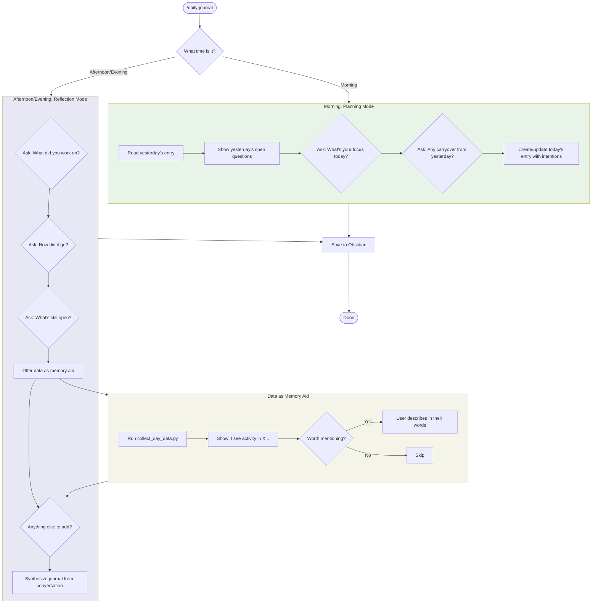

# Daily Journal

An interactive, conversational skill for creating meaningful daily journal entries. Conversation first, data second.

## Table of Contents

1. [Philosophy](#philosophy)
2. [Flow Diagram](#flow-diagram)
3. [Time-Aware Interaction](#time-aware-interaction)
4. [The Conversation](#the-conversation)
5. [Using Data as Memory Aid](#using-data-as-memory-aid)
6. [Markdown Conventions](#markdown-conventions)
7. [Template Structure](#template-structure)
8. [CLI Reference](#cli-reference)

## Philosophy

**Commits are not what matters.** They're often mechanical, LLM-generated, or busywork. A journal should capture:

- What you *actually* focused on
- How you *felt* about the work
- What's still open in your mind
- The human experience of the day

**Conversation first, data second.** Ask the user about their day. Use collected data (git, sessions) only as a *memory jogger* for days when they can't remember what they did.

**Context matters.** Weekends are different from workdays. Mornings are different from evenings. Hobby projects are valid. Tooling optimization is valid.

## Flow Diagram



## Time-Aware Interaction

Check the current time before starting. Different times trigger different modes:

| Time | Mode | Primary Questions |
|------|------|-------------------|
| Before noon | **Planning** | What's your focus? Carryover from yesterday? |
| Afternoon (12-5pm) | **Mid-day check** | How's the day going? Stuck on anything? |
| Evening (after 5pm) | **Reflection** | What did you work on? How did it go? |
| Weekend | **Lighter touch** | What did you tinker with? Any hobby wins? |

**How to check:**
```bash
# Get current time
date "+%H:%M %A"  # e.g., "14:32 Saturday"
```

Use this to:
1. Determine mode (morning/afternoon/evening)
2. Check if weekend (Saturday/Sunday) - add `weekend` tag, lighter expectations
3. Frame questions appropriately

## The Conversation

### Morning Mode (Planning)

1. Read yesterday's entry if it exists
2. Run `obsidian-semantic related "Daily Log/<yesterday>.md" -n 5` to surface notes related to yesterday's topics
3. Show yesterday's "Tomorrow's focus", "Open questions", and relevant related notes
4. Ask:
   - "What's your main focus for today?"
   - "Any carryover from yesterday you want to tackle?"
   - "Anything blocking you?"
4. Create entry with intentions (can be updated in evening)

### Evening Mode (Reflection)

1. **Start with open questions** - don't assume anything from data:
   - "What did you work on today?"
   - "How did it go? What felt good or frustrating?"
   - "Any wins? Any blockers?"
   - "What's still on your mind?"

2. **Offer data as memory aid** (only after user has shared):
   - "I see you also had activity in [project] - worth mentioning?"
   - "Looks like you touched [files] - anything notable there?"
   - User can say "no, that was just mechanical" and it gets skipped

3. **Ask about tomorrow**:
   - "What's your focus for tomorrow?"
   - "Any open questions to sleep on?"

### Weekend Mode

- Lighter expectations, different framing
- "What did you tinker with today?"
- "Any hobby wins?"
- "Did you rest?" (rest is valid!)
- Add `weekend` tag automatically

## Using Data as Memory Aid

The `collect_day_data.py` script is a **secondary tool**, not the primary input.

**When to use it:**
- User says "I can't remember what I did"
- After user has shared, to jog memory for forgotten items
- Never as the source of truth for what mattered

**How to present it:**
```
I see some activity that might jog your memory:
- 3 commits in claude-code-config
- 45 sessions in aou_qc
- Files touched in video-to-notes skill

Any of these worth mentioning in your own words?
```

**Running the script:**
```bash
cd /Users/ricardoavila/Projects/claude-code-config/claude/skills/daily-journal
uv run scripts/collect_day_data.py [--date YYYY-MM-DD] [--skip-sessions]
```

## Markdown Conventions

Clearly differentiate personal voice from LLM context using Obsidian-compatible markdown:

### Personal Reflections (User's Voice)

Use blockquotes for the user's own words and feelings:

```markdown
> Spent most of the morning yak-shaving on my dev tools again.
> It felt productive in the moment but I'm not sure it was the best use of time.
> The regenie debugging is getting frustrating - every fix reveals another issue.
```

### Context/Background (LLM-Provided)

Use regular text or callouts for factual context:

```markdown
> [!info] Context
> Continued from [[2026-01-23]] - regenie FID alignment debugging.
> Related to the empiroar benchmarking project.
```

### Technical Notes (If Needed)

Use collapsible sections for technical details that shouldn't dominate:

```markdown
<details>
<summary>Technical: FID alignment fix</summary>

The issue was that BGEN files use `FID=0` while PLINK uses `FID=IID`.
Fixed with: `awk '{$1=$2; print}' file.sample`

</details>
```

### Callout Types (Obsidian)

| Callout | Role | Example titles |
|---------|------|----------------|
| `[!info]` | Context, continuity, collapsible references | "Context", "Cloud Logging URLs" |
| `[!success]` | Wins, milestones, progress | "Win", "Big day", "Progress" |
| `[!warning]` | Concerns, friction, blockers | "Blocker", "Growing Pain" |
| `[!question]` | Open loops, things still thinking about | "Still thinking about..." |
| `[!bug]` | Bugs discovered | "Script Bug Found" |
| `[!note]` | Observations, non-actionable insights | "Observation: ..." |

Use the collapsible variant (`[!info]-`) for bulky reference material (URLs, log snippets).

See [callout-conventions.md](references/callout-conventions.md) for detailed examples and placement guidance.

## Template Structure

The final journal should feel personal, not mechanical:

```markdown
---
date: {date}
tags:
  - daily-log
  - {weekend if applicable}
  - {project tags from conversation}
---

## {date} - {day of week}

> {User's summary of the day in their own words - from conversation}

### What I Worked On

> {User's description of their focus, in their voice}

> [!info] Context
> {Any relevant background - continued from yesterday, etc.}

### How It Went

> {User's reflection on the experience - what felt good, what was frustrating}

### Open Loops

> [!question] Still thinking about...
> - {Open questions from conversation}
> - {Blockers mentioned}

### Tomorrow

> {User's stated intentions for tomorrow}

---

*{Day character} - {One-line takeaway}*

## Related

Use `obsidian-semantic related "Daily Log/{date}.md" -n 5` to populate with meaningful links:
- [[{relevant links from semantic search}]]
```

## CLI Reference

| Flag | Description |
|------|-------------|
| `--date YYYY-MM-DD` | Target date (default: today) |
| `--quick` | Skip interactive questions, just use data (not recommended) |

## Editing Past Entries

**Never delete historical context.** Journal entries are a record of thinking over time - even wrong thinking has value.

- **Cross out** outdated items with strikethrough: `~~Outdated info~~`
- Add a brief explanation when crossing out: `~~Thought X caused the bug~~ Turned out to be a race condition`
- **Only delete** if something is factually incorrect (e.g., wrong date, wrong project name)
- Completed items, debunked theories, abandoned plans, tasks no longer relevant → strike through, don't delete

**Examples:**

```markdown
### Open Loops

> [!question] Still thinking about...
> - ~~Should I re-run step 1 after changing FID format?~~ No, step 2 handles it
> - ~~Investigate flaky test in pipeline~~ Was a CI caching issue, fixed 2026-01-25
> - New question that replaced the old one
```

## Day Footer

Every entry ends with a footer: a horizontal rule followed by an italicized one-liner that captures the overall character of the day. This goes **after** the last content section and **before** the Related links.

**Format:** `*{Day character} - {One-line takeaway}*`

The "day character" is a brief descriptor of the day's shape — how long, what kind of energy. The takeaway summarizes the arc.

```markdown
---

*Full day - Cursor SSH working, merged analytical + common variant lists, BATCH_JOB_ID refactor complete, but blocked on gc-batch permissions for live testing*
```

**Guidelines:**
- Always include when closing off an entry at end of day
- Day character can mention: duration (short/full/long), time of day (morning/evening/overnight), energy (productive/scattered/chill)
- Takeaway should be conversational, not a formal summary
- Keep it to one line

## Anti-Patterns

**Don't:**
- Lead with commits or session counts
- Generate a "report" from data
- Assume commits = what mattered
- Write in third person about the user
- Fill in feelings or reflections without asking
- Delete outdated entries, completed items, or debunked theories (strike them out instead)

**Do:**
- Ask open questions first
- Let user describe in their own words
- Use data only as memory jogger
- Preserve the user's voice in the final output
- Respect that rest and hobby time are valid
