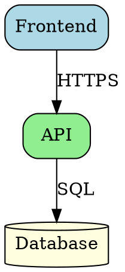
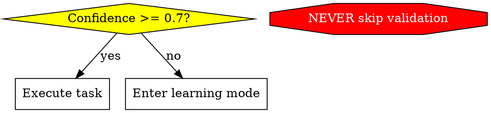
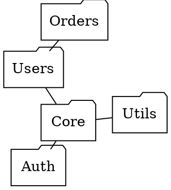

# Graphviz Diagrams

## Overview

This skill enables creation of architecture diagrams, protocol contracts, and system visualizations using Graphviz DOT language. Graphviz excels at rendering complex graph structures with automatic layout algorithms, making it ideal for system architecture, dependency graphs, decision trees, and formal protocol specifications.

## When to Use This Skill

Use this skill when:
- Creating system architecture diagrams with clear hierarchies
- Visualizing module or service dependencies
- Designing protocol contracts or decision-tree specifications
- Documenting agent workflows and collaboration patterns
- Generating state machines or control flow diagrams
- Creating binding implementation contracts
- Debugging DOT syntax errors or rendering issues

## Core Capabilities

### 1. DOT Syntax and Shape Conventions

Follow semantic shape conventions to make diagrams self-documenting:

**Key shapes:**
- **Diamond** - Decision points and questions
- **Box** - Actions and processes
- **Octagon** - Critical warnings and prohibitions (NEVER/MUST NOT)
- **Cylinder** - Databases and data stores
- **Doublecircle** - Entry and exit points

See `references/syntax_guide.md` for comprehensive syntax rules, color coding, edge labels, and validation checklist.

### 2. Layout Engine Selection

Choose the optimal layout engine for the diagram structure:

- **dot** - Hierarchical layouts (system architecture, dependency trees)
- **neato** - Symmetric graphs (network diagrams, peer relationships)
- **fdp** - Large graphs (social networks, minimize edge crossings)
- **circo** - Cyclic structures (circular dependencies, peer-to-peer)
- **twopi** - Radial structures (hub-and-spoke architectures)

See `references/layout_engines.md` for detailed selection guide, examples, and performance considerations.

### 3. Protocol Contract Creation

Create binding protocol specifications that serve as executable contracts:

**Protocol contract principles:**
- Diamond nodes represent explicit decision points
- All decision paths must be labeled (yes/no or descriptive conditions)
- Octagon shapes mark NEVER/MUST NOT constraints
- Note shapes document MUST requirements
- Approved diagrams become implementation contracts

See `references/protocol_templates.md` for reusable templates and best practices.

### 4. Validation and Rendering

Validate syntax and render diagrams to multiple formats:

**Validation script:**
```bash
# Validate syntax only
scripts/validate_diagram.py diagram.dot --validate-only

# Render with specific layout engine
scripts/validate_diagram.py diagram.dot -o output.svg --layout dot

# Test all layout engines
scripts/validate_diagram.py diagram.dot --test-all-layouts

# Render to PNG with high DPI
scripts/validate_diagram.py diagram.dot -o output.png --format png --dpi 300
```

## Workflow

When creating or debugging Graphviz diagrams:

1. **Analyze requirements** - Determine diagram type (architecture, protocol, dependency, etc.)
2. **Choose layout engine** - Select based on graph structure (see `references/layout_engines.md`)
3. **Select template** - Start with appropriate template from `references/protocol_templates.md`
4. **Create diagram** - Apply shape conventions from `references/syntax_guide.md`
5. **Validate syntax** - Use `scripts/validate_diagram.py --validate-only`
6. **Test rendering** - Try different layouts with `--test-all-layouts` if needed
7. **Refine design** - Optimize for clarity, adjust colors, group with subgraphs

## Resources

### scripts/

**validate_diagram.py** - Validation and rendering script for DOT files. Validates syntax, tests multiple layout engines, renders to SVG/PNG/PDF. Run without loading into context for quick validation.

### references/

**syntax_guide.md** - Comprehensive DOT syntax rules, shape conventions, naming patterns, color coding, edge labels, clustering, and pre-delivery checklist. Load when creating diagrams or debugging syntax errors.

**layout_engines.md** - Detailed guide on choosing between dot, neato, fdp, circo, and twopi layout engines. Includes decision tree, performance considerations, and examples for each engine. Load when unsure which layout to use.

**protocol_templates.md** - Reusable templates for protocol contracts, architecture diagrams, dependency graphs, decision trees, state machines, and agent workflows. Load when starting a new diagram type.

## Output Format

When delivering diagrams, provide:

1. **DOT source code** - Complete, validated Graphviz DOT syntax
2. **Layout recommendation** - Which engine works best and why
3. **Rendering notes** - Any special parameters or configuration needed
4. **Usage guidance** - How to render or embed the diagram
5. **Protocol status** - For contracts, note approval status and date

## Quality Standards

All diagrams must:
- Follow shape conventions from `references/syntax_guide.md`
- Use appropriate layout engine from `references/layout_engines.md`
- Have all decision nodes (diamonds) with labeled edges
- Include meaningful node labels (questions end with ?, actions start with verbs)
- Validate without syntax errors
- Render successfully with chosen layout engine
- Apply consistent color coding
- Group related components with subgraphs (when appropriate)

## Common Use Cases

### System Architecture Diagrams



**Use:** `dot` layout for hierarchical structure
**Load:** `references/protocol_templates.md` for architecture templates

### Protocol Contract



**Use:** `dot` layout for decision flow
**Load:** `references/protocol_templates.md` for protocol patterns

### Dependency Graph



**Use:** `fdp` or `neato` for symmetric dependencies
**Load:** `references/layout_engines.md` for engine comparison

## Validation Checklist

Before delivering, verify:
- [ ] Appropriate layout engine selected (dot/neato/fdp/circo/twopi)
- [ ] Consistent node shapes following semantic conventions
- [ ] Clear subgraph organization (if applicable)
- [ ] Meaningful edge labels (especially on diamond decision nodes)
- [ ] Protocol contracts have all decision paths explicitly labeled
- [ ] Warnings/constraints highlighted with octagon/red
- [ ] Diagram complexity manageable (<50 nodes preferred)
- [ ] Syntax validates with `scripts/validate_diagram.py --validate-only`
- [ ] Diagram renders correctly with chosen layout

## Advanced Techniques

### Clustering for Clarity

```dot
subgraph cluster_frontend {
  label = "Frontend Services";
  style = filled;
  fillcolor = lightblue;

  WebApp;
  MobileApp;
}
```

### Rank Control

```dot
// Keep nodes at same level
{ rank=same; NodeA; NodeB; }

// Force to top
{ rank=min; StartNode; }

// Force to bottom
{ rank=max; EndNode; }
```

### Edge Styling

```dot
// Bold for primary flow
A -> B [style=bold];

// Dashed for optional
A -> C [style=dashed];

// Dotted for async/triggers
A -> D [style=dotted, label="triggers"];
```

### Avoiding Ambiguous Flows

- Minimize edge crossings; reorganize nodes or split the workflow into clustered subgraphs when branches intersect.
- If a single node feeds mutually-exclusive branches, duplicate downstream processing nodes rather than converging everything into one box.
- When multiple branches must run in parallel, keep their edges visually separated (rank/cluster) and clarify ownership with labels or consistent edge styling. Only introduce color-coding when it serves clarity for users with color vision differences.

## Integration with claude-code-agents

When creating diagrams for the agent ecosystem:
- Show learning mode triggers (confidence < 0.7 decision points)
- Visualize memory storage interactions with `.memories/` folder
- Represent agent communication and knowledge sharing
- Include schema validation points
- Align with flat-file memory specification patterns

## Best Practices

1. **Start with templates** - Use `references/protocol_templates.md` as starting point
2. **Choose layout wisely** - Consult `references/layout_engines.md` before deciding
3. **Follow conventions** - Apply shape semantics from `references/syntax_guide.md`
4. **Test alternatives** - Use `--test-all-layouts` to compare options
5. **Validate early** - Check syntax before adding complexity
6. **Group logically** - Use subgraphs to organize related components
7. **Label clearly** - Every decision edge needs a descriptive label
8. **Optimize for clarity** - Prefer simple over comprehensive
9. **Version contracts** - Include approval date for protocol diagrams
10. **Document choices** - Note why specific layout/style was chosen
11. **Eliminate ambiguity** - Inspect rendered diagrams for intersecting or indistinguishable edges; rearrange or duplicate nodes until each flow is visually obvious.
