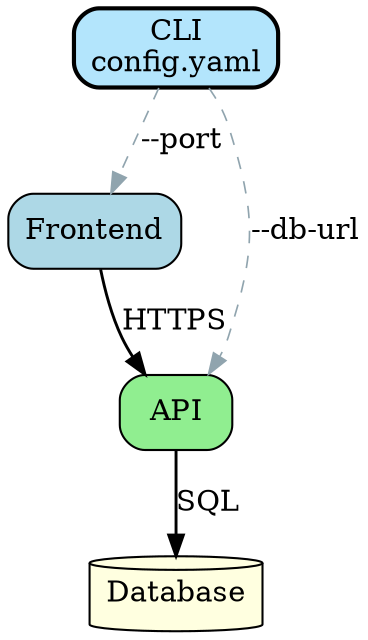
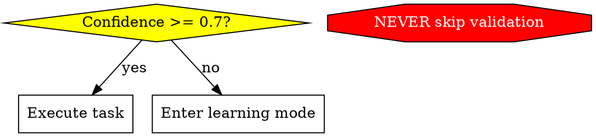
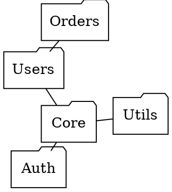

# Graphviz Diagrams

## Overview

This skill enables creation of architecture diagrams, protocol contracts, and system visualizations using Graphviz DOT language. Graphviz excels at rendering complex graph structures with automatic layout algorithms, making it ideal for system architecture, dependency graphs, decision trees, and formal protocol specifications.

## When to Use This Skill

Use this skill when:
- Creating system architecture diagrams with clear hierarchies
- Visualizing module or service dependencies
- Designing protocol contracts or decision-tree specifications
- Documenting agent workflows and collaboration patterns
- Generating state machines or control flow diagrams
- Creating binding implementation contracts
- Debugging DOT syntax errors or rendering issues

## When NOT to Use This Skill

Skip this skill for:
- Simple flowcharts with basic boxes and arrows (use default knowledge)
- Diagrams you've created many times before (familiar patterns)
- Quick visualizations where hand-editing is faster than formal structure
- Reading or analyzing existing .dot files (unless debugging syntax)

**Use this skill only when you need:**
- Semantic shape conventions for protocol contracts
- Layout engine selection guidance (dot vs neato vs fdp)
- Syntax validation or rendering troubleshooting
- Specific preferences (CLI edge styling, clustering patterns)

## Core Capabilities

### 1. DOT Syntax and Shape Conventions

Follow semantic shape conventions to make diagrams self-documenting:

**Key shapes:**
- **Diamond** - Decision points and questions
- **Box** - Actions and processes
- **Octagon** - Critical warnings and prohibitions (NEVER/MUST NOT)
- **Cylinder** - Databases and data stores
- **Doublecircle** - Entry and exit points

See `references/syntax_guide.md` for comprehensive syntax rules, color coding, edge labels, and validation checklist.

### 2. Layout Engine Selection

Choose the optimal layout engine for the diagram structure:

- **dot** - Hierarchical layouts (system architecture, dependency trees)
- **neato** - Symmetric graphs (network diagrams, peer relationships)
- **fdp** - Large graphs (social networks, minimize edge crossings)
- **circo** - Cyclic structures (circular dependencies, peer-to-peer)
- **twopi** - Radial structures (hub-and-spoke architectures)

See `references/layout_engines.md` for detailed selection guide, examples, and performance considerations.

### 3. Protocol Contract Creation & Interpretation

Create and interpret binding protocol specifications for agent collaboration:

**Creating contracts:**
- Diamond nodes = explicit decision points with labeled paths
- Octagon shapes = NEVER/MUST NOT constraints
- All decision edges must be labeled (yes/no or descriptive)
- Approved diagrams become implementation contracts

**Interpreting contracts:**
- Read .dot files to extract decision rules and constraints
- Understand protocol flow and conditional branches
- Validate implementations against protocol diagrams
- Identify decision points, guard conditions, and prohibited actions

Load `references/protocol_templates.md` for reusable templates and patterns.

### 4. Color Schemes

Apply evidence-based color principles (Munzner, Ware, Bertini):

- **Use hue for category, luminance for importance** - Color family distinguishes types, light/dark shows hierarchy
- **Color emphasizes grouping** (role, function), not connectivity - Let layout show relationships
- **Keep edge colors neutral and subdued** - Edges don't compete with nodes (except CLI edges: muted, dashed)
- **Encode flow/hierarchy with gradients, not multiple hues** - Sequential data uses light-to-dark in one hue
- **Maintain consistent color semantics** - One color = one meaning across entire diagram
- **Limit palette to 5-7 hues** - Beyond this, use luminance variation or redundant encodings

Load `references/color_guide.md` for detailed palettes (Brewer schemes, accessibility, case studies).

### 5. Validation and Rendering

```bash
scripts/validate_diagram.py diagram.dot --validate-only
scripts/validate_diagram.py diagram.dot --test-all-layouts
```

### 6. Rendering Workflow

Render both PNG (for review/critic) and SVG (for embedding in documents):

```bash
# PNG at 150 DPI for visual review and critic feedback
dot -Tpng -Gdpi=150 diagram.dot -o diagram.png

# SVG for embedding in Obsidian, web pages, documentation
dot -Tsvg diagram.dot -o diagram.svg
```

**Always keep the `.dot` source file** for future edits.

When using the `visual-design-critic` agent for feedback, **always ask the user before accepting revisions** - the critic provides suggestions, not mandates.

## Workflow

### Quick Start (Most Diagrams)

For standard architecture or dependency diagrams:

1. **Create diagram** - Use boxes, arrows, and standard DOT syntax
2. **Validate** - Run `scripts/validate_diagram.py --validate-only`
3. **Done** - Render with default `dot` layout

### Complex Diagrams

When you need semantic shapes, protocol contracts, or specialized layouts:

1. **Load references** - Based on needs:
   - `syntax_guide.md` - For semantic shapes (diamonds, octagons) or syntax debugging
   - `layout_engines.md` - When unsure if dot/neato/fdp is best
   - `protocol_templates.md` - For formal protocol contracts
2. **Apply patterns** - Follow loaded conventions
3. **Validate** - Check syntax and test rendering
4. **Refine** - Optimize clarity, test alternative layouts if needed

## Resources

**scripts/validate_diagram.py** - Validates DOT syntax, tests layout engines, renders to SVG/PNG/PDF.

**references/**
- **syntax_guide.md** - Shape conventions, syntax rules, edge labels. Load for semantic diagrams or syntax debugging.
- **layout_engines.md** - Engine selection guide (dot/neato/fdp/circo/twopi). Load when layout choice unclear.
- **protocol_templates.md** - Templates for contracts, state machines, workflows. Load for formal specifications.
- **color_guide.md** - Color principles, Brewer palettes, accessibility. Load for complex multi-category diagrams.

## Output Format

When delivering diagrams, provide:

1. **DOT source code** - Complete, validated Graphviz DOT syntax
2. **Layout recommendation** - Which engine works best and why
3. **Rendering notes** - Any special parameters or configuration needed
4. **Usage guidance** - How to render or embed the diagram
5. **Protocol status** - For contracts, note approval status and date

## Quality Checklist

Before delivering diagrams, verify:

**Structure & Layout:**
- [ ] Appropriate layout engine selected (dot for hierarchies, neato/fdp for dependencies)
- [ ] Diagram complexity manageable (<50 nodes preferred)
- [ ] Subgraphs used to group related components (when applicable)
- [ ] Nodes arranged to minimize edge crossings

**Semantics & Labels:**
- [ ] Consistent node shapes following semantic conventions (diamond=decision, box=action, octagon=warning)
- [ ] Meaningful node labels (questions end with ?, actions start with verbs)
- [ ] All decision nodes (diamonds) have labeled edges (yes/no or descriptive)
- [ ] Protocol contracts have all decision paths explicitly labeled
- [ ] Color encodes meaning: hue for category, luminance for importance
- [ ] Edge colors neutral/subdued (don't compete with nodes)
- [ ] Consistent color semantics maintained across diagram (one color = one meaning)

**Edge Styling:**
- [ ] Primary data flow uses bold, solid lines (penwidth=1.4+, vibrant colors)
- [ ] Control/CLI edges de-emphasized (color=#90a4ae, penwidth=0.8, style=dashed)
- [ ] Optional/async edges use dotted or dashed styles with descriptive labels
- [ ] Edge hierarchy maintained (data flow prominent, control receded)

**Validation:**
- [ ] Syntax validates with `scripts/validate_diagram.py --validate-only`
- [ ] Diagram renders correctly with chosen layout engine
- [ ] No ambiguous or indistinguishable flows

## Common Use Cases

### System Architecture Diagrams



**Use:** `dot` layout for hierarchical structure
**Shows:** CLI edge de-emphasis (control) vs data flow prominence

### Protocol Contract



**Use:** `dot` layout for decision flow
**Load:** `references/protocol_templates.md` for protocol patterns

### Dependency Graph



**Use:** `fdp` or `neato` for symmetric dependencies
**Load:** `references/layout_engines.md` for engine comparison

## Advanced Techniques

### Clustering

Group related components with subgraphs for visual organization:

```dot
subgraph cluster_frontend {
  label = "Frontend Services";
  style = filled;
  fillcolor = lightblue;
  WebApp; MobileApp;
}
```

### Rank Control

Control node positioning for clearer layout:

```dot
{ rank=same; NodeA; NodeB; }  // Same level
{ rank=min; StartNode; }       // Force to top
{ rank=max; EndNode; }         // Force to bottom
```

### Edge Styling & Clarity

**Hierarchy:**
- **Primary data flow:** Solid, bold (penwidth=1.4+), vibrant colors
- **Control/CLI edges:** Muted (#90a4ae), thin (0.8), dashed - recede into background
- **Optional/async:** Dotted or dashed with descriptive labels

**Avoiding ambiguity:**
- Minimize edge crossings (reorganize nodes, use clusters)
- Duplicate nodes if branches are mutually exclusive (don't converge everything)
- Separate parallel branches visually (rank/cluster with clear labels)

