# Graphviz Layout Engines Guide

Graphviz provides multiple layout engines, each optimized for different graph structures. Choosing the right engine dramatically improves diagram clarity and effectiveness.

## Contents

- [Engine Comparison](#engine-comparison)
- [dot - Hierarchical Layout](#dot---hierarchical-layout)
- [neato - Spring Model Layout](#neato---spring-model-layout)
- [fdp - Force-Directed Placement](#fdp---force-directed-placement)
- [circo - Circular Layout](#circo---circular-layout)
- [twopi - Radial Layout](#twopi---radial-layout)
- [Choosing the Right Layout Engine](#choosing-the-right-layout-engine)
- [Testing Multiple Layouts](#testing-multiple-layouts)
- [Performance Considerations](#performance-considerations)
- [Advanced Layout Control](#advanced-layout-control)
- [Common Issues and Solutions](#common-issues-and-solutions)
- [Best Practices](#best-practices)

## Engine Comparison

| Engine | Best For | Algorithm | Typical Use Cases |
|--------|----------|-----------|-------------------|
| **dot** | Hierarchies | Hierarchical | System architecture, dependency trees, control flows, org charts |
| **neato** | Symmetric graphs | Spring model | Network diagrams, undirected graphs, peer relationships |
| **fdp** | Large graphs | Force-directed | Large networks, social graphs, minimize edge crossings |
| **circo** | Cyclic structures | Circular | Cyclic dependencies, peer-to-peer networks, circular workflows |
| **twopi** | Radial structures | Radial | Hub-and-spoke, radial hierarchies, centralized architectures |

## dot - Hierarchical Layout

### When to Use

- **System architecture** with clear layers (frontend → backend → database)
- **Dependency trees** showing parent-child relationships
- **Control flows** with sequential or branching logic
- **Organizational charts** with reporting structures
- **Protocol contracts** with decision trees

### Best When

- Clear hierarchy or flow direction exists
- Nodes have parent-child or predecessor-successor relationships
- Reading flow (top-to-bottom or left-to-right) is natural

### Pattern

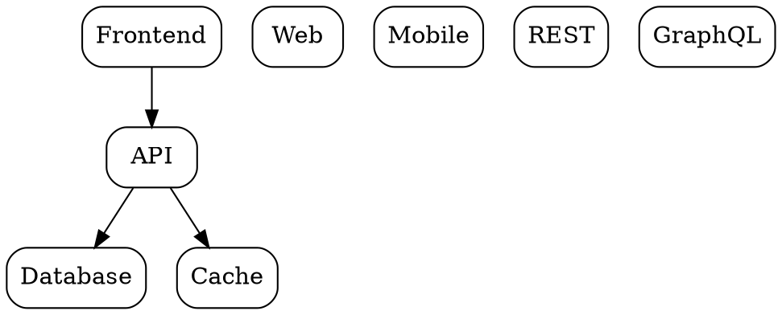

### Example: Microservices Architecture

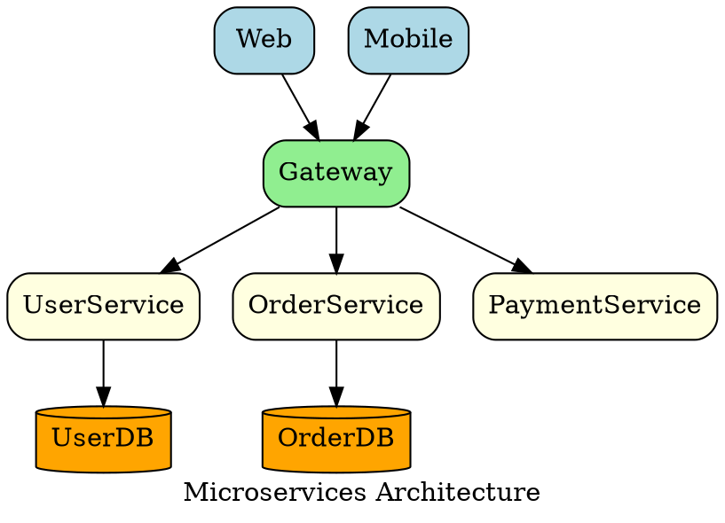

### Tips

- Use `rankdir=LR` for wide, shallow hierarchies
- Use `rankdir=TB` for deep, narrow hierarchies
- Control node placement with `{ rank=same; ... }`
- Add `constraint=false` to edges that shouldn't affect ranking

## neato - Spring Model Layout

### When to Use

- **Network diagrams** with undirected relationships
- **Peer-to-peer architectures** with symmetric connections
- **Relational structures** without clear hierarchy
- **Small to medium graphs** (< 100 nodes)

### Best When

- Nodes have symmetric relationships (A connects to B, B connects to A)
- No clear hierarchy or flow direction
- Emphasizing connectivity over direction

### Pattern

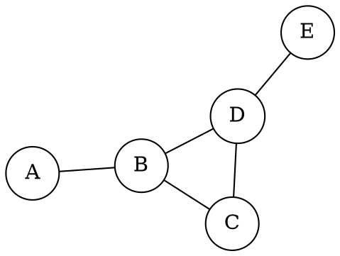

### Example: Service Mesh

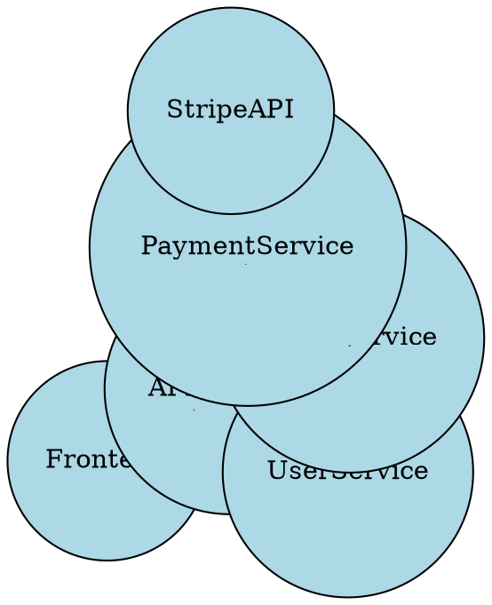

### Tips

- Use `overlap=false` to prevent node overlap
- Adjust `sep` parameter to control spacing
- Set `start` for reproducible layouts
- Better for smaller graphs (neato can be slow for large graphs)

## fdp - Force-Directed Placement

### When to Use

- **Large graphs** with complex connectivity (100+ nodes)
- **Clustered networks** with natural groupings
- **Social networks** or collaboration graphs
- **Graphs where minimizing edge crossings is critical**

### Best When

- Need to visualize large, complex graphs
- Graph has natural clustering
- Want to minimize edge crossings automatically
- Performance matters (fdp is faster than neato for large graphs)

### Pattern

```dot
graph LargeNetwork {
  layout = fdp;

  // Force-directed parameters
  K = 0.6;  // Spring constant (default 0.3)
  maxiter = 600;  // Maximum iterations

  // Your nodes and edges
  node [shape=circle];
  // ... many nodes and edges ...
}
```

### Example: Module Dependencies

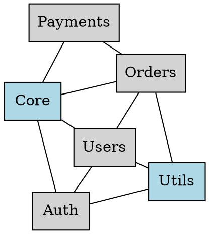

### Tips

- Increase `K` to spread nodes further apart
- Use `maxiter` to control convergence quality vs speed
- fdp handles large graphs better than neato
- Consider clustering for very large graphs (1000+ nodes)

## circo - Circular Layout

### When to Use

- **Cyclic dependencies** or circular relationships
- **Peer-to-peer networks** with no central authority
- **Circular workflows** or state machines with cycles
- **Round-robin or ring topologies**

### Best When

- Showing circular relationships or cycles
- All nodes have similar importance (no hierarchy)
- Emphasizing cyclic nature of the system

### Pattern

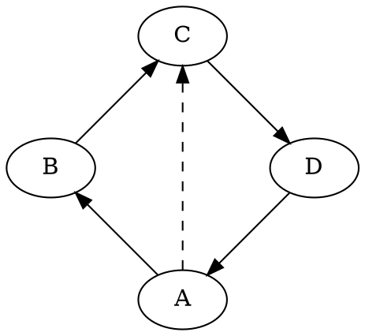

### Example: Distributed Consensus

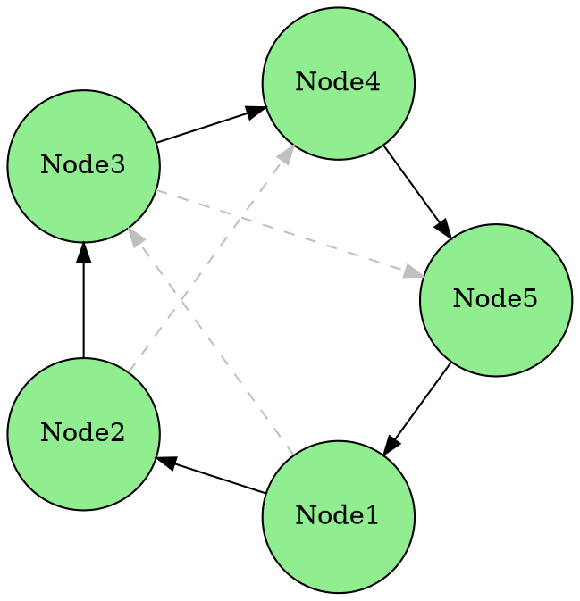

### Tips

- Works best with 5-20 nodes
- Use `mindist` to control minimum node separation
- Combine with `rankdir` for orientation control
- Good for visualizing state machines with cycles

## twopi - Radial Layout

### When to Use

- **Hub-and-spoke architectures** with central node
- **Radial hierarchies** expanding from center
- **Centralized systems** with peripheral services
- **Star topologies** in network design

### Best When

- One central node with radiating dependencies
- Clear center-to-periphery hierarchy
- Emphasizing central importance

### Pattern

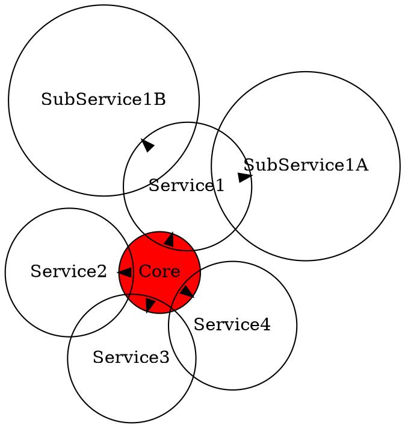

### Example: API Hub Architecture

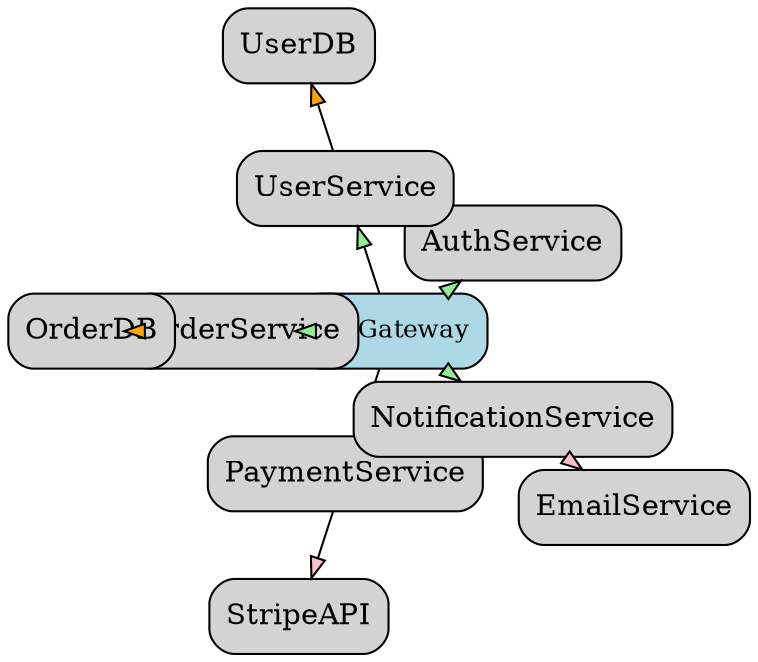

### Tips

- Always specify `root` parameter
- Use `ranksep` to control radial distance between levels
- Combine with node sizing to emphasize hierarchy
- Works best with tree-like structures

## Choosing the Right Layout Engine

### Decision Tree

```
Start
  │
  ├─ Is there a clear hierarchy?
  │   └─ YES → Use **dot**
  │
  ├─ Is the graph undirected or symmetric?
  │   └─ YES → Use **neato** (small) or **fdp** (large)
  │
  ├─ Does the graph have cycles or circular flow?
  │   └─ YES → Use **circo**
  │
  ├─ Is there one central node?
  │   └─ YES → Use **twopi**
  │
  └─ Large graph with complex connectivity?
      └─ YES → Use **fdp**
```

### Use Case Matrix

| Diagram Type | Primary Engine | Alternative | Reason |
|--------------|----------------|-------------|--------|
| System architecture | dot | neato | Usually hierarchical |
| Dependency graph | dot | fdp | Tree structure |
| Network topology | neato | fdp | Symmetric connections |
| State machine | dot | circo | Sequential or cyclic |
| Org chart | dot | - | Clear hierarchy |
| Service mesh | neato | fdp | Peer relationships |
| Hub-and-spoke | twopi | dot | Central node |
| Large social graph | fdp | neato | Many nodes/edges |
| Circular workflow | circo | dot | Cyclic nature |

## Testing Multiple Layouts

Use the validation script to test all layouts:

```bash
# Test all layout engines and compare results
python validate_diagram.py diagram.dot --test-all-layouts

# Renders to:
# diagram_dot.svg
# diagram_neato.svg
# diagram_fdp.svg
# diagram_circo.svg
# diagram_twopi.svg
```

Compare the outputs and choose the layout that best communicates the diagram's structure and relationships.

## Performance Considerations

### Engine Speed (fastest to slowest for large graphs)

1. **dot** - O(n + e) where n=nodes, e=edges (fastest)
2. **fdp** - O(n log n) for force calculation
3. **neato** - O(n²) for spring model (slower for large graphs)
4. **circo** - O(n) for circular layout
5. **twopi** - O(n) for radial layout

### Scalability Guidelines

| Engine | Small (<20) | Medium (20-100) | Large (100-500) | Very Large (500+) |
|--------|-------------|-----------------|-----------------|-------------------|
| dot | ✅ Excellent | ✅ Excellent | ✅ Good | ⚠️ Usable |
| neato | ✅ Excellent | ✅ Good | ⚠️ Slow | ❌ Too slow |
| fdp | ✅ Excellent | ✅ Excellent | ✅ Good | ✅ Good |
| circo | ✅ Excellent | ✅ Good | ⚠️ Usable | ❌ Not suitable |
| twopi | ✅ Excellent | ✅ Good | ✅ Good | ⚠️ Usable |

## Advanced Layout Control

### Combining Engines

Some diagrams benefit from mixed approaches:

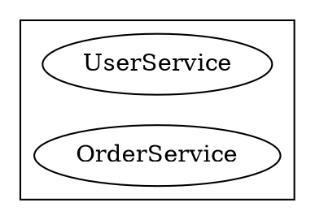

### Layout Attributes

```dot
// Global layout tuning
digraph Tuned {
  layout = dot;

  // Spacing
  ranksep = 1.5;  // Vertical separation between ranks
  nodesep = 0.5;  // Horizontal separation between nodes

  // Size constraints
  size = "8,10";  // Max width,height in inches
  ratio = fill;   // Fill the size

  // Edge routing
  splines = ortho;  // Orthogonal edges (right angles)
  // splines = polyline;  // Polyline edges
  // splines = curved;    // Curved edges
}
```

## Common Issues and Solutions

### Overlapping Nodes

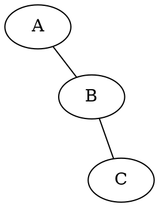

### Poor Aspect Ratio

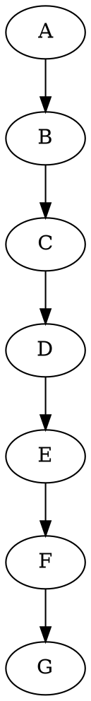

### Slow Rendering

```dot
// Problem: Large graph renders slowly with neato
graph SlowGraph {
  layout = neato;
  // 500 nodes...
}

// Solution: Switch to fdp
graph FastGraph {
  layout = fdp;
  K = 0.3;  // Adjust spring constant
  // 500 nodes...
}
```

## Best Practices

1. **Start with dot** - It handles most use cases well
2. **Test alternatives** - Use `--test-all-layouts` to compare
3. **Consider your audience** - Choose layout that matches mental model
4. **Optimize for clarity** - Layout should make relationships obvious
5. **Be consistent** - Use same engine for similar diagram types
6. **Document your choice** - Note why you chose a specific layout
7. **Test at scale** - Verify layout works with realistic data size
8. **Iterate** - Try different engines if first choice doesn't work well
