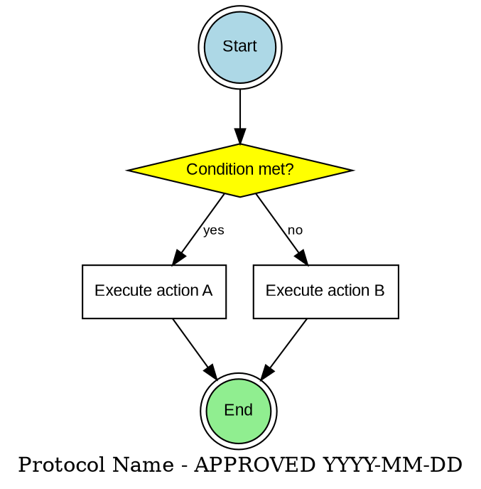
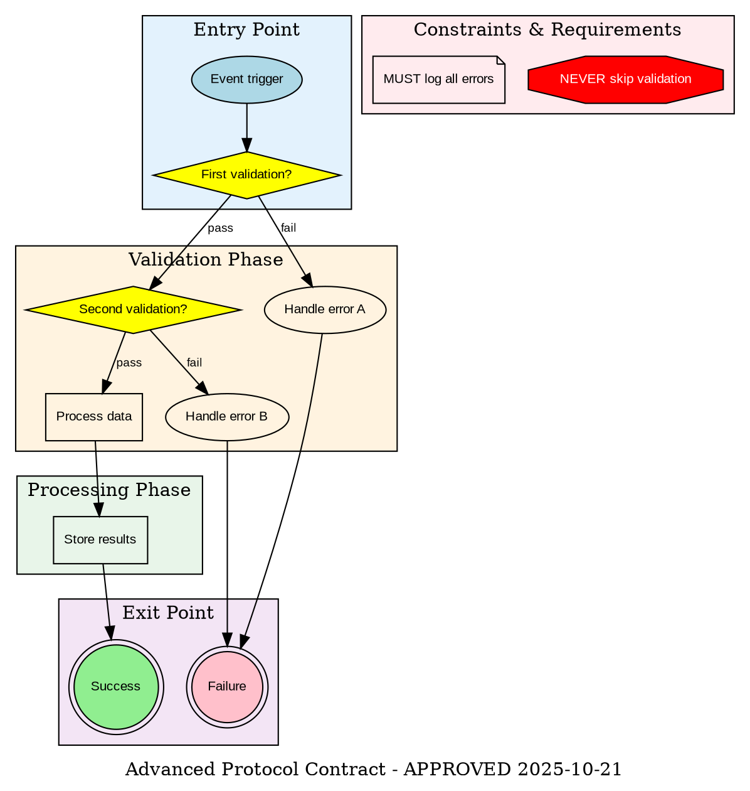
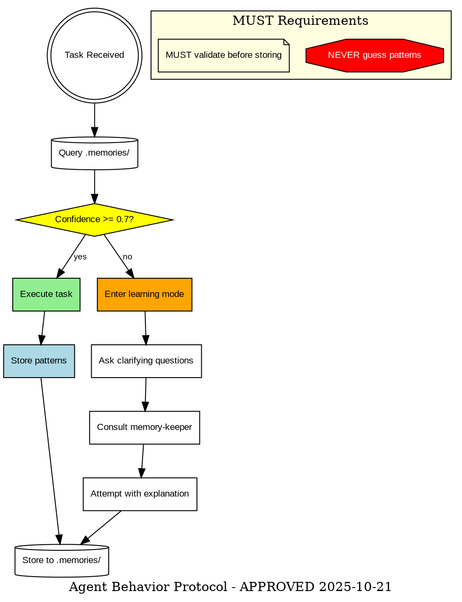
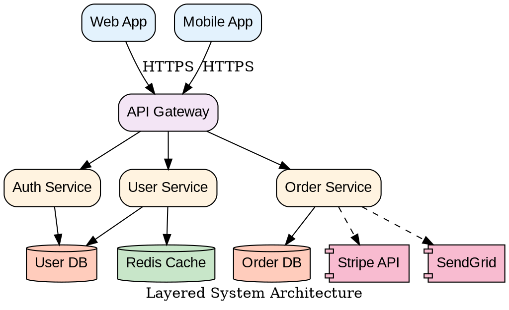
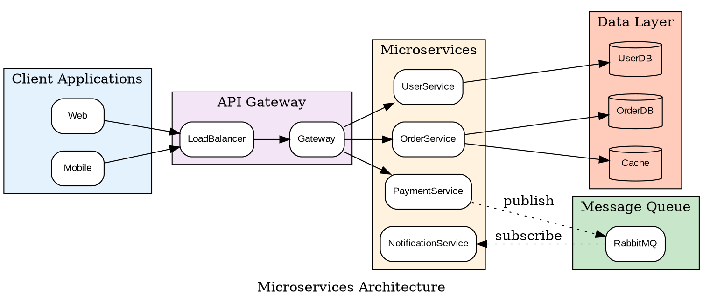
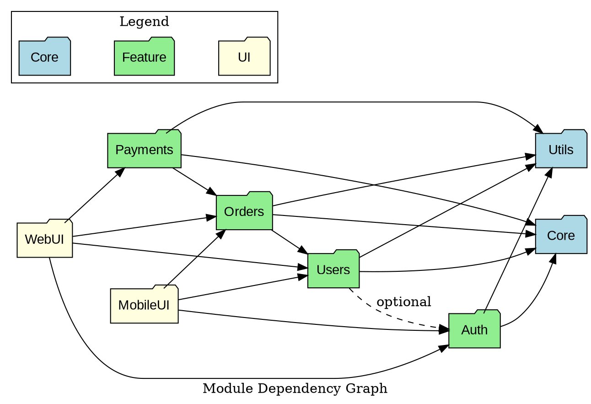
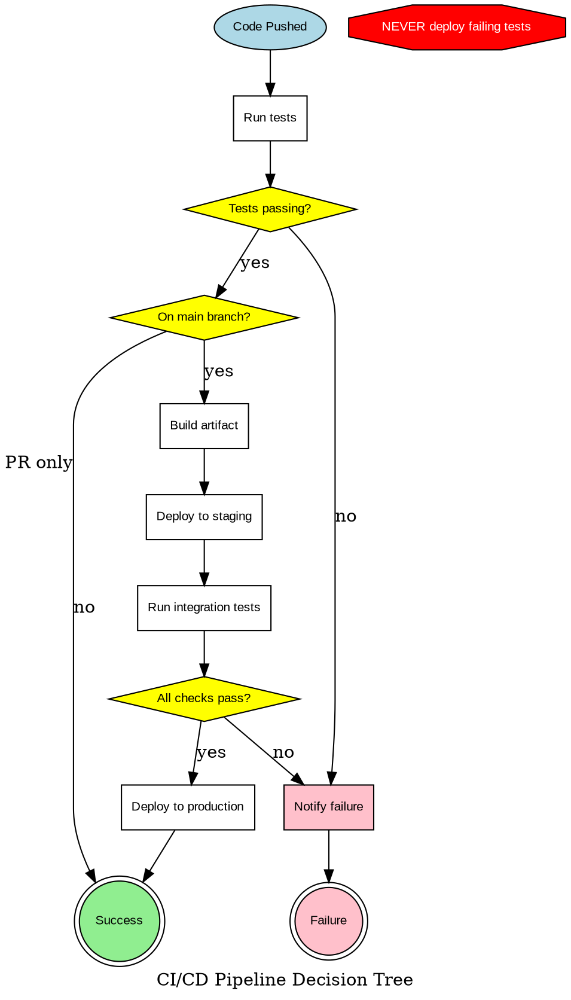
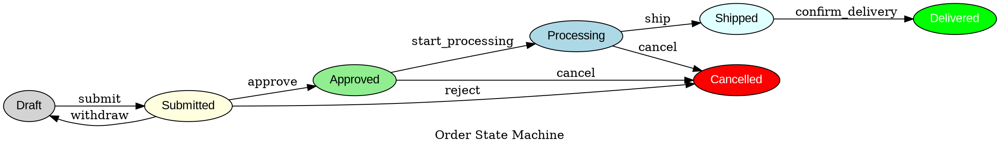
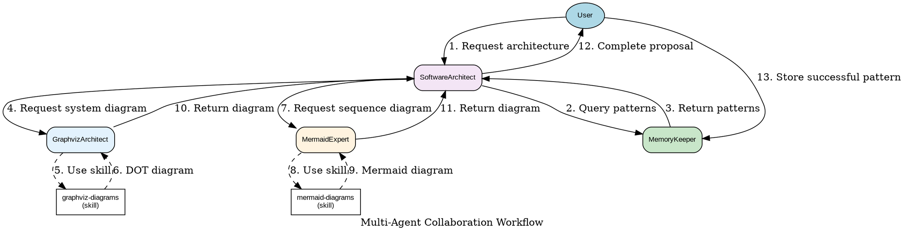

# Graphviz Protocol Contract Templates

This document provides reusable templates for creating protocol contracts, architecture diagrams, and decision-tree specifications using Graphviz DOT language.

## Protocol Contract Template

Protocol contracts are executable specifications that define how agents or systems must behave. Once approved, they become binding implementation contracts.

### Key Principles

1. **Diamond nodes = Decision points** - Explicit branches in reasoning/logic
2. **Subgraphs = Logical phases** - Group related decision sequences
3. **Shape semantics** - Each shape conveys specific meaning (see syntax_guide.md)
4. **Binding contract** - Once approved, this defines required behavior
5. **Completeness** - All decision paths must be explicitly handled

### Basic Protocol Template



### Advanced Protocol with Phases



## Agent Protocol Contract Template

Specific template for agent decision-making protocols in the claude-code-agents ecosystem.



## Architecture Diagram Template

### Layered Architecture



### Microservices Architecture



## Dependency Graph Template



## Decision Tree Template



## State Machine Template



## Integration Workflow Template

For claude-code-agents ecosystem - showing agent collaboration:



## Template Usage Guidelines

### Choosing a Template

1. **Protocol Contract** - Binding decision-tree specifications for agent/system behavior
2. **Agent Protocol** - Learning mode, confidence thresholds, memory integration
3. **Layered Architecture** - Traditional tiered systems (presentation → business → data)
4. **Microservices** - Distributed services with message queues and async communication
5. **Dependency Graph** - Module/package dependencies, build order
6. **Decision Tree** - Workflow automation, approval processes
7. **State Machine** - Entity lifecycle, status transitions
8. **Integration Workflow** - Multi-agent/multi-system collaboration

### Customizing Templates

1. **Copy the template** - Start with the closest match
2. **Update labels** - Replace placeholder names with your domain terms
3. **Adjust structure** - Add/remove nodes and edges as needed
4. **Apply styling** - Use consistent colors from syntax_guide.md
5. **Add metadata** - Include approval date, version, purpose in label
6. **Validate syntax** - Use validation script before finalizing
7. **Test layout** - Try different engines if default doesn't work well

### Protocol Contract Workflow

1. **Design phase** - Create protocol diagram from requirements
2. **Review phase** - Stakeholders review and request changes
3. **Approval phase** - Add approval date to diagram label
4. **Storage phase** - Save to `.claude/protocols/[name].dot`
5. **Implementation phase** - Implementing agents reference protocol
6. **Validation phase** - Verify implementation matches protocol

### Protocol Implementation Contract

When a protocol is approved, implementing agents receive:

```markdown
BEFORE writing code, review: .claude/protocols/protocol-name.dot

This diagram is the APPROVED architecture contract. Your implementation MUST:
✓ Follow every decision path shown
✓ Handle all diamond (decision) nodes explicitly
✓ Implement all error paths
✓ Respect all octagon (NEVER) constraints
✓ Implement all note (MUST) requirements

Any deviation requires architecture review and approval.
```

## Best Practices

1. **Be complete** - Show all decision paths, no implicit branches
2. **Use semantic shapes** - Follow shape conventions consistently
3. **Label clearly** - Every edge from a diamond must have a label
4. **Group logically** - Use subgraphs for phases or components
5. **Highlight constraints** - Use octagon shapes for NEVER/MUST NOT rules
6. **Document requirements** - Use note shapes for MUST requirements
7. **Version contracts** - Include approval date in diagram label
8. **Test rendering** - Validate before presenting
9. **Store protocols** - Save approved protocols for reference
10. **Enforce contracts** - Reference protocols during implementation
