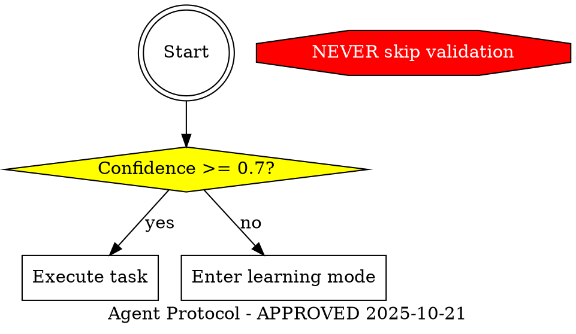
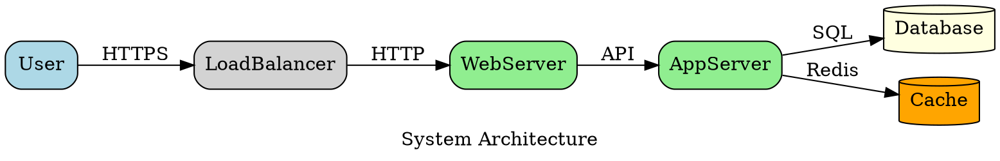

# Graphviz DOT Syntax Guide

This reference document contains comprehensive DOT syntax rules, shape conventions, naming patterns, and validation guidelines for creating effective Graphviz diagrams.

## Contents

- [Shape Conventions](#shape-conventions)
- [Naming Conventions](#naming-conventions)
- [Edge Labels and Styles](#edge-labels-and-styles)
- [Color Coding](#color-coding)
- [Clustering with Subgraphs](#clustering-with-subgraphs)
- [Graph Attributes](#graph-attributes)
- [Edge Annotations](#edge-annotations)
- [Common Patterns](#common-patterns)
- [Pre-Delivery Validation Checklist](#pre-delivery-validation-checklist)
- [Validation Commands](#validation-commands)
- [Common Syntax Errors](#common-syntax-errors)
- [Performance Optimization](#performance-optimization)
- [Best Practices Summary](#best-practices-summary)

## Shape Conventions

Use consistent shapes to convey meaning. Following these conventions makes diagrams self-documenting and easier to understand.

### Standard Node Shapes

| Shape | Usage | Syntax | Example |
|-------|-------|--------|---------|
| **Diamond** | Decision points and questions | `shape=diamond` | "Is test passing?" |
| **Box** | Actions and processes (default) | `shape=box` | "Run tests", "Deploy service" |
| **Plaintext** | Literal commands and code | `shape=plaintext` | `git commit -m 'msg'` |
| **Ellipse** | States and conditions | `shape=ellipse` | "Build complete", "Idle" |
| **Octagon** | Critical warnings/prohibitions | `shape=octagon, style=filled, fillcolor=red` | "NEVER use git add -A" |
| **Doublecircle** | Entry and exit points | `shape=doublecircle` | "Start", "End" |
| **Cylinder** | Databases and data stores | `shape=cylinder` | "PostgreSQL", "Redis Cache" |
| **Component** | External systems | `shape=component` | "Auth Service", "Payment API" |
| **Folder** | Modules and packages | `shape=folder` | "backend/", "utils/" |
| **Note** | Annotations and requirements | `shape=note` | "MUST implement retry logic" |

### Shape Usage Examples

```dot
// Decision tree pattern
"Check status?" [shape=diamond, fillcolor=yellow, style=filled];

// Process action
"Deploy to production" [shape=box];

// Literal command
"git push origin main" [shape=plaintext, fontfamily="Courier"];

// Critical warning
"NEVER skip tests" [shape=octagon, fillcolor=red, fontcolor=white, style=filled];

// Database
"users_db" [shape=cylinder, fillcolor=lightyellow];

// Entry point
"Start" [shape=doublecircle];
```

## Naming Conventions

Consistent naming improves diagram readability and clarity.

### Node Label Patterns

1. **Questions** - End with "?" for decision points
   ```dot
   "Should I proceed?" [shape=diamond];
   "Is build passing?" [shape=diamond];
   ```

2. **Actions** - Start with verbs for processes
   ```dot
   "Write the test" [shape=box];
   "Search for patterns" [shape=box];
   "Deploy service" [shape=box];
   ```

3. **Commands** - Literal and executable for plaintext nodes
   ```dot
   "grep -r 'pattern' ." [shape=plaintext];
   "docker build -t myapp ." [shape=plaintext];
   ```

4. **States** - Describe situations for ellipses
   ```dot
   "Test is failing" [shape=ellipse];
   "Stuck on error" [shape=ellipse];
   "Build complete" [shape=ellipse];
   ```

## Edge Labels and Styles

### Binary Decisions

Use "yes"/"no" labels for diamond decision nodes:

```dot
"Is test passing?" -> "Deploy" [label="yes"];
"Is test passing?" -> "Fix bugs" [label="no"];
```

### Multiple Choices

Use descriptive condition labels with "otherwise" for default paths:

```dot
"Check environment" -> "Production flow" [label="production"];
"Check environment" -> "Staging flow" [label="staging"];
"Check environment" -> "Development flow" [label="otherwise"];
```

### Edge Styles

```dot
// Bold for primary flow
A -> B [style=bold];

// Dashed for optional/fallback
A -> C [style=dashed];

// Dotted for triggers/events
A -> D [style=dotted, label="triggers"];

// Colored edges for categorization
A -> E [color=blue, label="HTTPS"];
A -> F [color=red, label="error path"];
```

## Color Coding

Use consistent colors to categorize components and improve visual hierarchy.

### Standard Color Palette

```dot
// Frontend components
node [fillcolor="#e3f2fd", style=filled, color="#1976d2"];

// Backend services
node [fillcolor="#f3e5f5", style=filled, color="#7b1fa2"];

// Databases
node [fillcolor="#fff3e0", style=filled, color="#f57c00"];

// External services
node [fillcolor="#fce4ec", style=filled, color="#c2185b"];

// Cache layers
node [fillcolor="#e8f5e9", style=filled, color="#388e3c"];

// Warnings/errors
node [fillcolor="#ffebee", style=filled, color="#c62828"];

// Success states
node [fillcolor="#e8f5e9", style=filled, color="#2e7d32"];
```

### Color Class Pattern

```dot
// Define reusable style classes
node [fontname="Arial", fontsize=10];
edge [fontname="Arial", fontsize=9];

// Apply to specific nodes
Frontend [fillcolor="#e3f2fd", style=filled];
Backend [fillcolor="#f3e5f5", style=filled];
Database [fillcolor="#fff3e0", style=filled];
```

## Clustering with Subgraphs

Group related components using subgraphs for visual organization.

### Basic Subgraph Pattern

```dot
subgraph cluster_frontend {
  label = "Frontend Services";
  style = filled;
  fillcolor = "#e3f2fd";

  WebApp;
  MobileApp;
}

subgraph cluster_backend {
  label = "Backend Services";
  style = filled;
  fillcolor = "#f3e5f5";

  API;
  Workers;
}
```

### Nested Subgraphs

```dot
subgraph cluster_services {
  label = "Microservices";

  subgraph cluster_api {
    label = "API Layer";
    REST_API;
    GraphQL_API;
  }

  subgraph cluster_workers {
    label = "Background Workers";
    EmailWorker;
    DataWorker;
  }
}
```

## Graph Attributes

### Global Settings

```dot
digraph MyDiagram {
  // Graph-level attributes
  label = "System Architecture";
  fontname = "Arial";
  fontsize = 14;
  rankdir = TB;  // Top-to-bottom (or LR for left-to-right)
  bgcolor = "white";

  // Node defaults
  node [fontname="Arial", fontsize=10, shape=box, style=rounded];

  // Edge defaults
  edge [fontname="Arial", fontsize=9, color=gray];

  // Your diagram content here
}
```



### Rank Control

```dot
// Keep nodes at same level
{ rank=same; NodeA; NodeB; NodeC; }

// Force minimum rank (top)
{ rank=min; StartNode; }

// Force maximum rank (bottom)
{ rank=max; EndNode; }
```

## Edge Annotations

Add context to relationships with labels and attributes:

```dot
// Data flow with protocol
Frontend -> API [label="HTTPS", style=bold];

// Database connection with details
API -> Database [label="SQL\n(pooled)", color=blue];

// Cache pattern
API -> Cache [label="GET/SET", style=dashed];
Cache -> Database [label="read-through", color=gray];

// Asynchronous communication
Service1 -> Queue [label="publish", style=dotted];
Queue -> Service2 [label="subscribe", style=dotted];
```

## Common Patterns

### Protocol Contract Pattern



### Architecture Diagram Pattern



## Pre-Delivery Validation Checklist

Before submitting any Graphviz diagram, verify:

- [ ] Proper graph declaration (`digraph` or `graph`)
- [ ] Matched opening and closing braces
- [ ] Consistent node shapes following conventions
- [ ] All decision nodes (diamonds) have labeled outgoing edges
- [ ] Edge labels are clear and descriptive
- [ ] Warnings/constraints use octagon shape with red fill
- [ ] Entry/exit points clearly marked (doublecircle)
- [ ] Subgraphs used for logical grouping (when appropriate)
- [ ] Color coding is consistent and meaningful
- [ ] Font choices are readable (Arial, Helvetica recommended)
- [ ] Commands in plaintext nodes are executable
- [ ] Diagram complexity is manageable (<50 nodes preferred)
- [ ] Syntax validates with Graphviz CLI

## Validation Commands

```bash
# Validate syntax and render to SVG
dot -Tsvg input.dot -o output.svg

# Render to PNG with high DPI
dot -Tpng -Gdpi=300 input.dot -o output.png

# Render to PDF
dot -Tpdf input.dot -o output.pdf

# Test different layout engines
neato -Tsvg input.dot -o output-neato.svg
fdp -Tsvg input.dot -o output-fdp.svg
circo -Tsvg input.dot -o output-circo.svg
twopi -Tsvg input.dot -o output-twopi.svg
```

## Common Syntax Errors

### Missing Semicolons

```dot
// ❌ WRONG - Missing semicolons
A -> B
B -> C

// ✅ CORRECT
A -> B;
B -> C;
```

### Unquoted Labels with Spaces

```dot
// ❌ WRONG - Unquoted label with spaces
Deploy to production [shape=box];

// ✅ CORRECT
"Deploy to production" [shape=box];
```

### Mismatched Braces

```dot
// ❌ WRONG - Missing closing brace
digraph MyGraph {
  A -> B;

// ✅ CORRECT
digraph MyGraph {
  A -> B;
}
```

### Invalid Shape Names

```dot
// ❌ WRONG - Typo in shape name
A [shape=dimond];

// ✅ CORRECT
A [shape=diamond];
```

## Performance Optimization

### Keep Diagrams Manageable

- **Limit nodes**: Under 50 nodes for readability
- **Use subgraphs**: Group related components
- **Split large diagrams**: Break into multiple focused diagrams
- **Minimize crossing edges**: Arrange nodes to reduce visual complexity

### Layout Optimization

- **Choose appropriate layout engine**: See layout_engines.md
- **Use rank constraints**: Control node placement with `rank=same`
- **Simplify edge paths**: Avoid unnecessary edge routing
- **Test performance**: Validate rendering speed with large diagrams

## Best Practices Summary

1. **Use semantic shapes** - Diamond for decisions, box for actions, octagon for warnings
2. **Label clearly** - Questions end with ?, actions start with verbs
3. **Color consistently** - Use the standard palette for categories
4. **Group logically** - Employ subgraphs for related components
5. **Annotate edges** - Add labels to clarify relationships
6. **Validate early** - Test syntax before adding complexity
7. **Keep it simple** - Prefer clarity over completeness
8. **Document purpose** - Add graph label and metadata comments
