# Mermaid Diagram Templates

This document provides reusable templates for common diagram patterns. Copy and adapt these templates for standard use cases.

## Contents

- [System Architecture Template](#system-architecture-template)
- [API Sequence Diagram Template](#api-sequence-diagram-template)
- [Data Flow Pipeline Template](#data-flow-pipeline-template)
- [State Machine Template](#state-machine-template)
- [Decision Tree Template](#decision-tree-template)
- [Microservices Architecture Template](#microservices-architecture-template)
- [CI/CD Pipeline Template](#cicd-pipeline-template)
- [Class Diagram Template](#class-diagram-template)
- [Entity Relationship Template](#entity-relationship-template)
- [Gantt Chart Template](#gantt-chart-template)
- [User Journey Template](#user-journey-template)
- [Template Usage Guidelines](#template-usage-guidelines)

## System Architecture Template

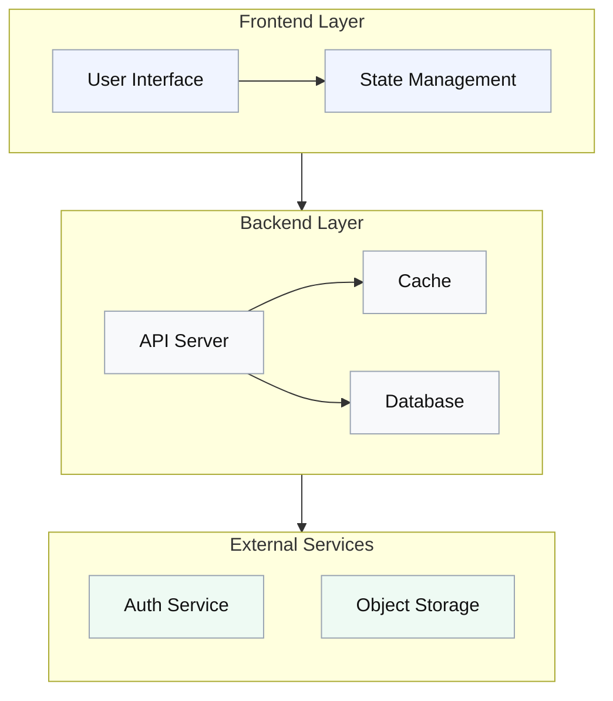

## API Sequence Diagram Template

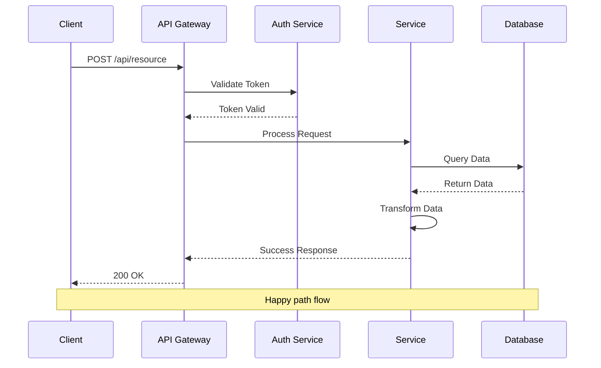

## Data Flow Pipeline Template

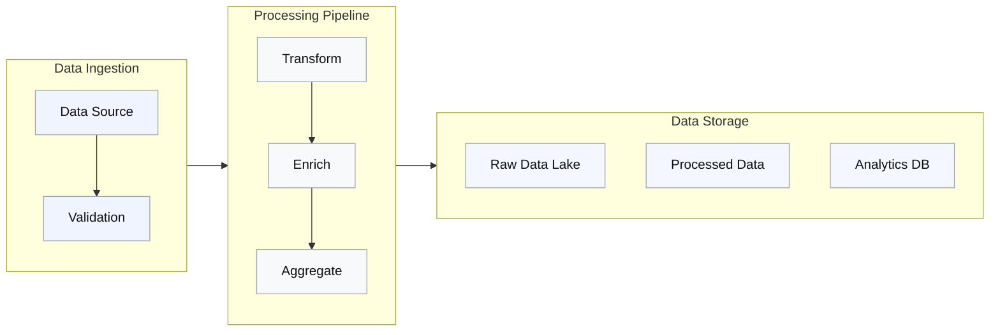

## State Machine Template

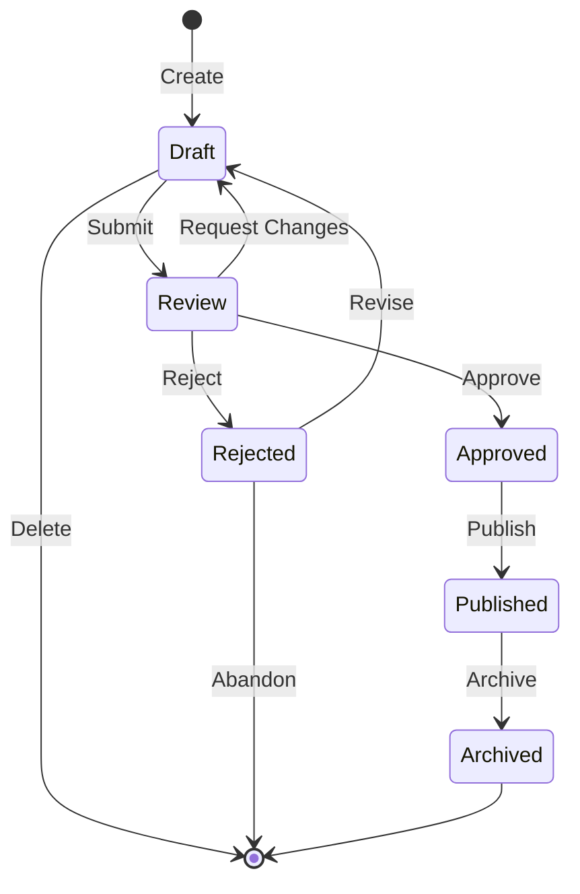

## Decision Tree Template

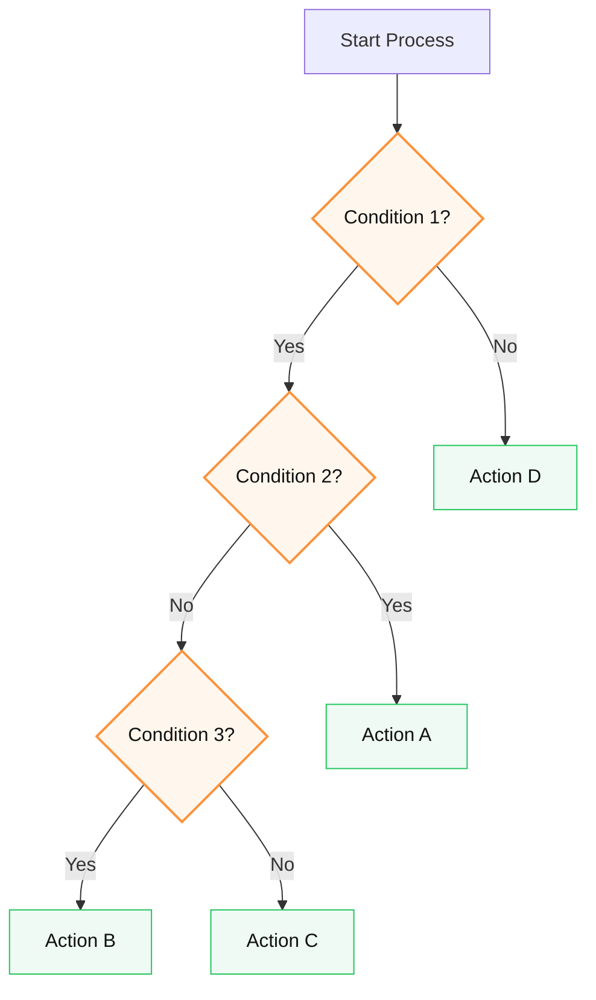

## Microservices Architecture Template

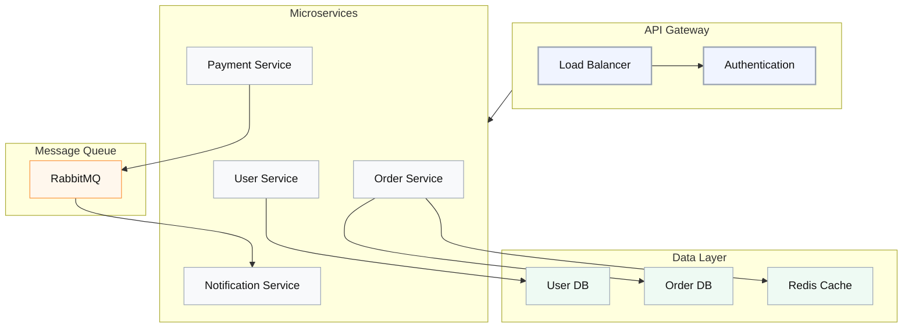

## CI/CD Pipeline Template

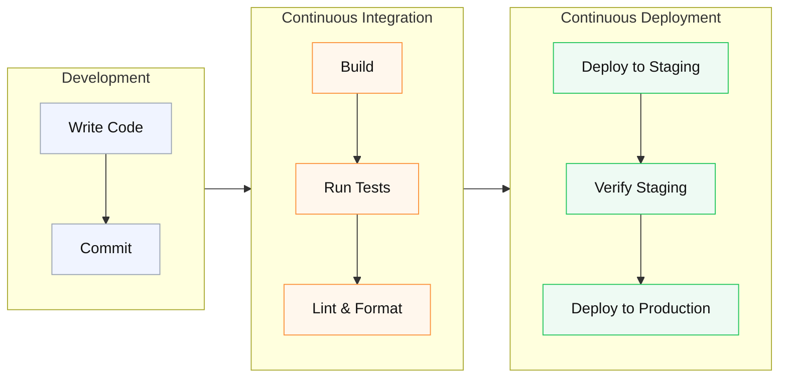

## Class Diagram Template

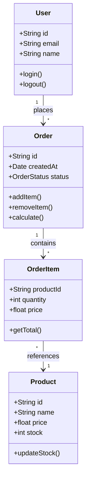

## Entity Relationship Template

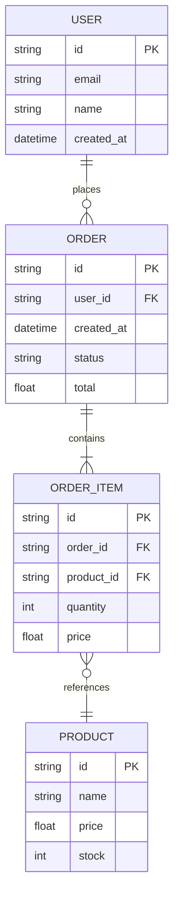

## Gantt Chart Template

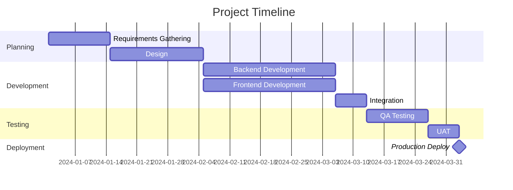

## User Journey Template

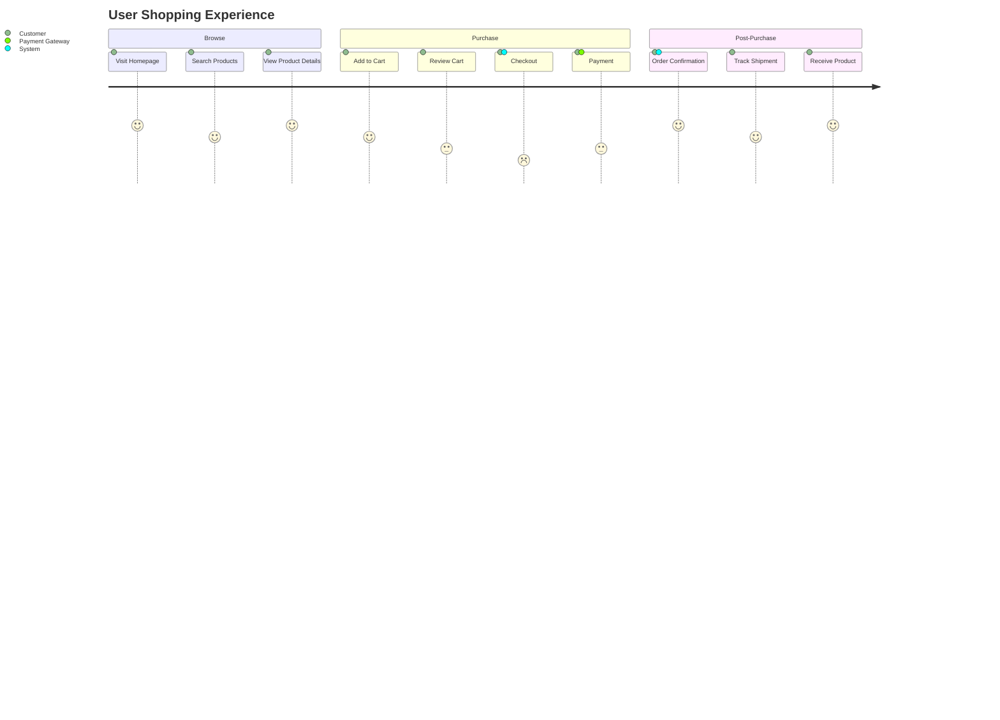

## Template Usage Guidelines

### Choosing a Template

1. **System Architecture** - High-level system design, component relationships
2. **API Sequence** - API interactions, request/response flows
3. **Data Flow Pipeline** - ETL processes, data transformation workflows
4. **State Machine** - Entity lifecycle, workflow states
5. **Decision Tree** - Conditional logic, branching processes
6. **Microservices** - Service-oriented architecture, distributed systems
7. **CI/CD Pipeline** - Build and deployment workflows
8. **Class Diagram** - Object-oriented design, class relationships
9. **Entity Relationship** - Database schema, data models
10. **Gantt Chart** - Project timelines, scheduling
11. **User Journey** - User experience flows, interaction mapping

### Customizing Templates

1. **Copy the template** - Start with the closest match
2. **Rename elements** - Update labels to match your domain
3. **Adjust structure** - Add/remove nodes and connections
4. **Apply styling** - Use consistent color palette from syntax guide
5. **Validate syntax** - Check against `syntax_guide.md` rules
6. **Test rendering** - Use validation script to verify

### Color Coding

Use the standard palette for consistency:

- **Input/Sources** - Light blue (#f0f4ff)
- **Processing** - Light gray (#f8f9fb)
- **Calculations** - Light green (#eefaf3)
- **Outputs** - Light purple (#f4f7ff)
- **Warnings/Decisions** - Light orange (#fff7ed)
- **Success** - Green accent (#22c55e)
- **Error** - Red accent (#ef4444)
