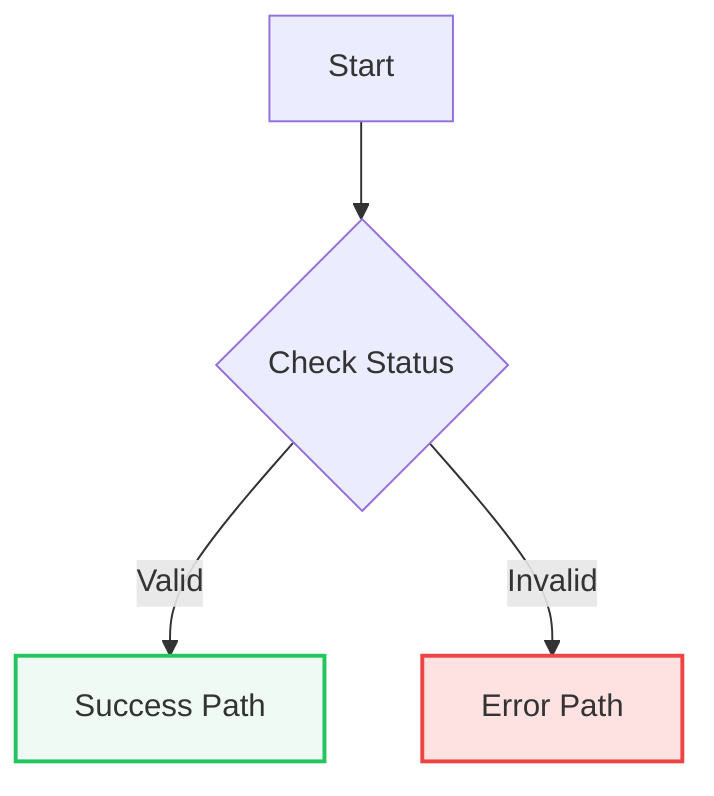
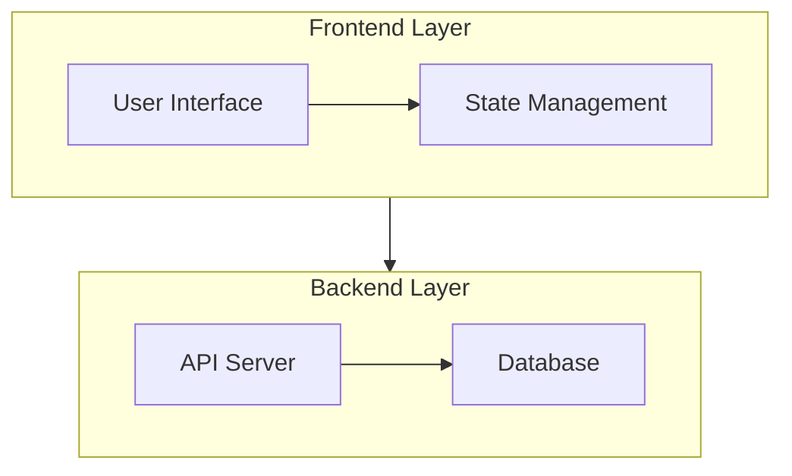
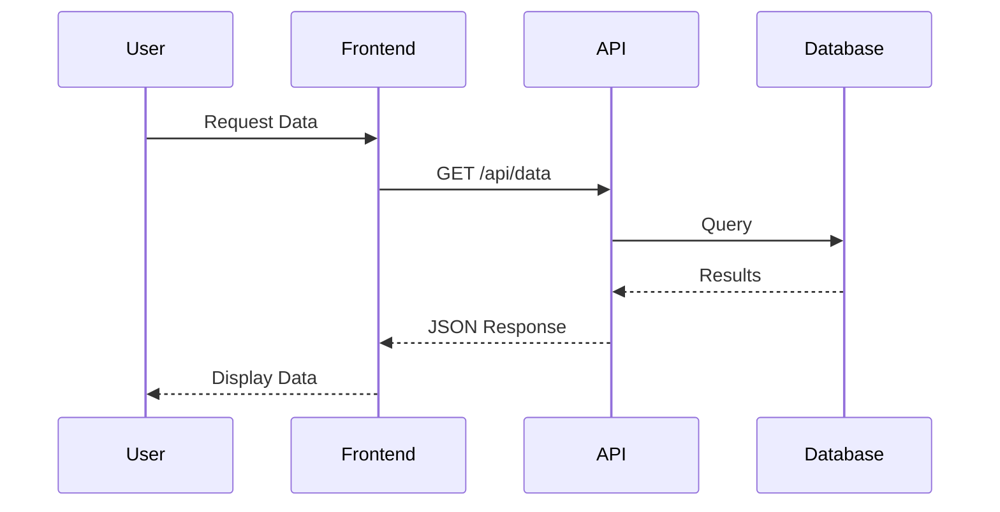

# Mermaid Syntax Guide

This reference document contains comprehensive syntax rules, debugging patterns, and common pitfalls for Mermaid diagrams.

## Contents

- [Critical Syntax Patterns](#critical-syntax-patterns)
- [Common Parse Errors and Fixes](#common-parse-errors-and-fixes)
- [Pre-Delivery Validation Checklist](#pre-delivery-validation-checklist)
- [Standard Color Palette](#standard-color-palette)
- [Advanced Syntax Patterns](#advanced-syntax-patterns)
- [Testing and Validation](#testing-and-validation)
- [Performance Optimization](#performance-optimization)

## Critical Syntax Patterns

Based on extensive experience with Mermaid parsing issues, follow these patterns to ensure diagrams render correctly.

### Label Quoting Rules

**Always quote labels** in these scenarios:

1. **Labels with HTML tags:**
   ```mermaid
   A["Title<br/>Subtitle"]
   B["<strong>Bold Text</strong>"]
   ```

2. **Labels with special characters:**
   ```mermaid
   B["Process A->B"]
   C["Items: 1, 2, 3"]
   D["Value >= 100"]
   ```

3. **Subgraph titles:**
   ```mermaid
   subgraph S1["Stream 1 - Cross"]
       direction TB
       A["Node"]
   end
   ```

### Unicode and Symbol Handling

**Convert all Unicode symbols to ASCII equivalents:**

| Unicode | ASCII | Example |
|---------|-------|---------|
| `↔` | `<->` | Bidirectional arrow |
| `×` | `x` | Multiplication |
| `≥` | `>=` | Greater than or equal |
| `·` / `•` / `–` / `—` | `-` | Various dashes and bullets |
| `→` | `->` | Arrow |
| `'` / `'` | `'` | Smart quotes |
| `"` / `"` | `"` | Smart double quotes |

**Example transformation:**
```mermaid
// ❌ WRONG - Unicode symbols
A["Data ↔ Server"]
B["Count × 10"]

// ✅ CORRECT - ASCII equivalents
A["Data <-> Server"]
B["Count x 10"]
```

### Class Management

**Avoid inline class tokens** - never use `:::class` syntax:

```mermaid
// ❌ WRONG - Inline class annotation
A["Node"]:::myClass

// ✅ CORRECT - Explicit class statement
classDef myClass fill:#f8f9fb,stroke:#9aa4b2,stroke-width:1px,color:#111;
A["Node label"]
class A myClass
```

**Avoid reserved class names:**

```mermaid
// ❌ WRONG - Reserved words
classDef in fill:#f0f4ff
classDef out fill:#f4f7ff

// ✅ CORRECT - Safe alternatives
classDef input fill:#f0f4ff
classDef output fill:#f4f7ff
```

### Subgraph Best Practices

1. **Always quote subgraph titles:**
   ```mermaid
   subgraph S1["Processing Pipeline"]
       A["Step 1"]
   end
   ```

2. **Add direction inside subgraphs:**
   ```mermaid
   subgraph S1["Vertical Flow"]
       direction TB
       A["Top"]
       B["Bottom"]
       A --> B
   end
   ```

3. **Use semicolons for multiple statements on one line:**
   ```mermaid
   subgraph S1["Compact Layout"]
       direction LR
       A["Foo"]; B["Bar"]; A --> B;
   end
   ```

## Common Parse Errors and Fixes

### Error: "Parse error on line X"

**Causes:**
- Unquoted labels with special characters
- Unicode symbols in labels
- Inline class annotations (`:::class`)
- Unquoted subgraph titles

**Fix checklist:**
1. Quote all labels with HTML or special chars
2. Convert Unicode to ASCII
3. Remove `:::` annotations, use explicit class statements
4. Quote subgraph titles

### Error: "Diagram failed to render"

**Causes:**
- Reserved class names (`in`, `out`)
- Missing direction in subgraphs
- Malformed arrows or connections

**Fix checklist:**
1. Use `input`/`output` instead of `in`/`out`
2. Add `direction TB` or `direction LR` inside subgraphs
3. Verify arrow syntax (e.g., `-->`, `-.->`, `==>`)

### Error: "Unexpected token"

**Causes:**
- Smart quotes instead of straight quotes
- Missing semicolons in compact layouts
- Malformed node IDs

**Fix checklist:**
1. Replace `"` and `"` with `"`
2. Add semicolons when placing multiple statements per line
3. Ensure node IDs are alphanumeric (A-Z, 0-9, underscore)

## Pre-Delivery Validation Checklist

Before delivering any Mermaid diagram, verify:

- [ ] All labels with HTML/symbols are quoted
- [ ] No `:::` inline class annotations
- [ ] Classes named `input`/`output` (not `in`/`out`)
- [ ] Subgraph titles quoted; `direction TB/LR` set inside
- [ ] ASCII symbols only, or HTML-escaped
- [ ] Semicolons added when placing multiple statements on one line
- [ ] Diagram tested for renderability (CLI or live editor)

## Standard Color Palette

Use consistent colors for diagram elements:

```mermaid
classDef input fill:#f0f4ff,stroke:#9aa4b2,stroke-width:1px,color:#111;
classDef process fill:#f8f9fb,stroke:#9aa4b2,stroke-width:1px,color:#111;
classDef calculation fill:#eefaf3,stroke:#9aa4b2,stroke-width:1px,color:#111;
classDef output fill:#f4f7ff,stroke:#9aa4b2,stroke-width:1px,color:#111;
classDef warning fill:#fff7ed,stroke:#fb923c,stroke-width:2px,color:#111;
```

**Usage:**
- **input** - Data inputs, user inputs, external sources
- **process** - Processing steps, transformations, operations
- **calculation** - Mathematical operations, computations
- **output** - Final results, outputs, deliverables
- **warning** - Warnings, errors, critical decision points

## Advanced Syntax Patterns

### Conditional Styling



### Complex Subgraph Layouts



### Sequence Diagram Participants



## Testing and Validation

### CLI Validation

Test diagrams with Mermaid CLI:

```bash
npx --yes @mermaid-js/mermaid-cli -i diagram.mmd -o diagram.svg -c mermaid.config.json
```

### Configuration File

Create `mermaid.config.json` for HTML label support:

```json
{
  "securityLevel": "loose",
  "flowchart": {
    "htmlLabels": true,
    "wrap": true,
    "useMaxWidth": true
  },
  "theme": "default"
}
```

### Online Editor

Validate syntax at: https://mermaid.live/

## Performance Optimization

### Keep Diagrams Manageable

- **Limit nodes:** Under 20-25 nodes per diagram
- **Split large diagrams:** Break into multiple focused diagrams
- **Use subgraphs:** Organize related elements for clarity
- **Minimize crossing lines:** Arrange nodes to reduce visual complexity

### Rendering Performance

- **Avoid deeply nested subgraphs:** Maximum 2-3 levels
- **Simplify arrows:** Use direct connections when possible
- **Limit styling:** Excessive class definitions slow rendering
- **Test early:** Validate small before adding complexity
