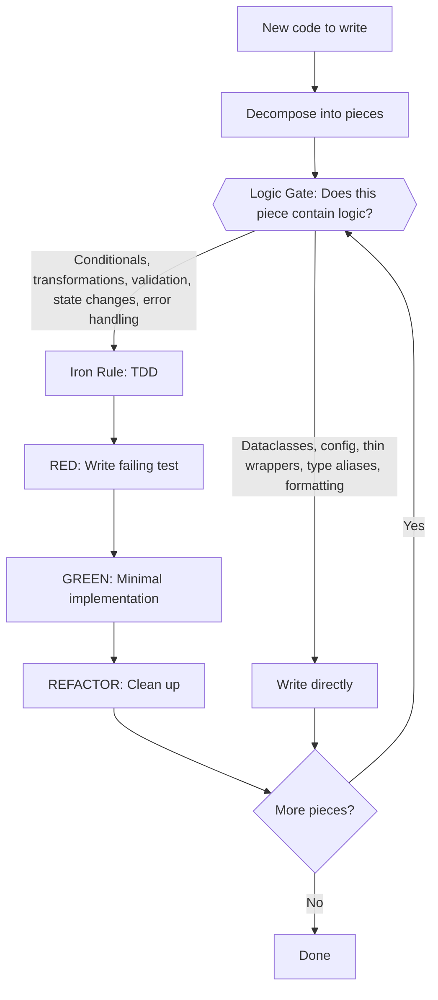

# Test-Driven Development (TDD)

## The Two Gates

Before writing any code, pass it through two gates:

1. **The Logic Gate** — Triage. Does this piece contain logic?
2. **The Iron Rule** — For everything that passes the Logic Gate, strict TDD applies.

## Gate 1: The Logic Gate

Decompose the work into its constituent pieces. For each piece, ask: **does this contain logic?**

**Passes the Logic Gate (requires TDD):**
- Conditionals and branching
- Data transformations and computations
- Validation and parsing
- State management and transitions
- Error handling with recovery logic
- Business rules and domain logic
- Algorithm implementations

**Does NOT pass the Logic Gate (write directly):**
- Dataclasses, NamedTuples, TypedDicts (pure data declarations)
- Type aliases and protocol definitions
- Configuration and constants
- Thin wrappers that only delegate (no branching, no transformation)
- Plot formatting and visual styling
- Boilerplate (`__init__.py`, module-level setup)
- String templates and static content

**When in doubt:** If you can't point to a conditional, transformation, or state change, it probably doesn't pass the Logic Gate.

### Triage Output

Before writing code, briefly identify what passes and what doesn't:
- "These pieces contain logic and need TDD: X, Y"
- "These are declarations/glue and can be written directly: Z"

## Gate 2: The Iron Rule

**For code that passes the Logic Gate: never write logic without a preceding failing test.**

If logic is written before its test:
1. Stop — the test you write now can only describe what you already wrote, not verify intended behavior
2. Delete the logic and restart test-first
3. This applies to logic specifically, not declarations

## Red-Green-Refactor Cycle

### RED: Write a Failing Test

Write a single minimal test demonstrating intended behavior:
- Clear, descriptive name
- Test actual functionality (not mocks unless necessary)
- Focus on one behavior
- If test name contains "and", split into separate tests

### Verify RED: Confirm Failure

Run tests and confirm:
- Test fails for the expected reason (missing feature)
- Not failing due to syntax errors
- This verification is non-negotiable

### GREEN: Minimal Implementation

Write the simplest possible code satisfying the test:
- Avoid feature creep
- Don't refactor unrelated code
- Don't over-engineer

### Verify GREEN: Confirm Pass

Confirm:
- The new test passes
- No existing tests break

### REFACTOR: Clean Up

Improve code quality while maintaining green status:
- Eliminate duplication
- Improve naming
- Simplify logic
- Run tests after each change

## Quality Test Attributes

**Minimal:** Single responsibility per test
**Clear:** Descriptive name revealing behavior
**Realistic:** Demonstrate intended API usage
**Focused:** One assertion per test (generally)

## Common Rationalizations to Reject

**"I'll test afterward"**
- Tests written post-implementation pass immediately
- Proves nothing about validation capability

**"Manual testing covered edge cases"**
- Lacks systematic documentation
- Not reproducible

**"Tests-after achieve identical goals"**
- Tests-first answer: "What should happen?"
- Tests-after answer: "What does this do?"
- Fundamentally different approaches

## Verification Checklist

Before considering work complete:
- [ ] Logic Gate triage was performed
- [ ] Every piece containing logic has corresponding tests
- [ ] Each test for logic failed before implementation
- [ ] Failures occurred for expected reasons
- [ ] Code written is minimal
- [ ] All tests pass without errors or warnings
- [ ] Real code tested (mocks only when necessary)
- [ ] Edge cases and error conditions covered for logic

## Debugging Integration

Bug found? Write failing test reproducing it. Follow TDD cycle. Test proves fix and prevents regression.

Never fix bugs without a test.

## Integration with Other Skills

**Testing skill ecosystem:**
- **testing-anti-patterns** — What to avoid when writing tests (mocking pitfalls, production pollution). Especially relevant during the RED phase: ensure tests validate behavior, not mock existence.
- **legacy-code-testing** — When adding tests to existing untested code (seams, characterization tests). Start with the Logic Gate to identify which legacy code actually needs tests.
