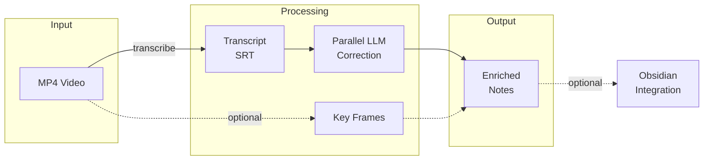

# Video to Notes

Transform screen recordings (MP4) into comprehensive, enriched meeting notes by combining automated transcription, visual frame extraction, and document synthesis.

## Table of Contents

- [Quick Reference](#quick-reference)
- [Workflow Overview](#workflow-overview)
- [Step 1: Transcribe Video](#step-1-transcribe-video)
- [Step 2: Extract Key Frames (Optional)](#step-2-extract-key-frames-optional)
- [Step 3: Evaluate and Process Extracted Frames](#step-3-evaluate-and-process-extracted-frames)
- [Step 3.5: Image Post-Processing](#step-35-image-post-processing)
- [Step 4: Correct Transcription Errors (Parallel Processing)](#step-4-correct-transcription-errors-parallel-processing)
- [Step 5: Create Enriched Notes](#step-5-create-enriched-notes)
- [Step 6: Obsidian Integration (Optional)](#step-6-obsidian-integration-optional)
- [File Organization](#file-organization)
- [Dependencies](#dependencies)
- [Configuration](#configuration)

## Quick Reference

```bash
# Transcribe video to SRT (timestamped subtitles)
~/.claude/skills/video-to-notes/scripts/transcribe.py recording.mp4

# Apply high-frequency replacements (in-place)
~/.claude/skills/video-to-notes/scripts/apply_replacements.py recording.srt -i

# Split SRT for parallel correction (outputs JSON with chunk info)
~/.claude/skills/video-to-notes/scripts/split_srt.py recording.srt --chunk-size 35

# Extract frame at specific timestamp
ffmpeg -ss 00:05:22 -i recording.mp4 -frames:v 1 -q:v 2 output.jpg -y

# Crop image - detect boxes and crop to selection with padding
~/.claude/skills/video-to-notes/scripts/detect_boxes.py frame.jpg --keep-nested --crop A -p 20 -o cropped.jpg
```

## Workflow Overview



## Step 1: Transcribe Video

Run the transcription script:

```bash
~/.claude/skills/video-to-notes/scripts/transcribe.py <video.mp4>
```

**Options:**
- `--format srt` (default) - Timestamped subtitles
- `--format txt` - Plain text
- `--format json` - Structured JSON
- `--keep-mp3` - Retain intermediate audio file

**Output:** Creates `<basename>.srt` in same directory as video.

**Requirements:** `ffmpeg` must be installed (`brew install ffmpeg`).

## Step 2: Extract Key Frames (Optional)

Ask the user: "Would you like to extract key frames from the video for visual context?"

If yes, identify timestamps where visual context adds value:
- Code being shown/edited
- Diagrams or architecture drawings
- Charts, plots, or data visualizations
- UI demonstrations
- Hand-drawn annotations

**Extract frames:**

```bash
mkdir -p "<video_basename>/"
ffmpeg -ss HH:MM:SS -i <video.mp4> -frames:v 1 -q:v 2 "<video_basename>/MM-SS_description.jpg" -y
```

**Naming convention:** `MM-SS_brief-description.jpg`

## Step 3: Evaluate and Process Extracted Frames

**CRITICAL:** Most screen recording frames add NO value to meeting notes. Evaluate each frame critically before including it.

For detailed evaluation criteria, classification types, and the decision matrix, read:
`~/.claude/skills/video-to-notes/references/frame-evaluation.md`

**Quick decision guide:**
- DELETE: Redundant, noisy, or better as text
- EXTRACT: Contains code/text not in transcript → extract then delete image
- RE-CREATE: Hand-drawn concepts → create clean Graphviz/TikZ diagram
- KEEP: Only if visual is truly essential to understanding

## Step 3.5: Image Cropping

Crop extracted frames to remove distracting UI elements and focus on relevant content.

**CRITICAL: ALWAYS use `detect_boxes.py` for cropping.** Do NOT use manual ImageMagick commands (`convert -crop`) - the detect_boxes workflow produces better results and is more repeatable.

### Bounding Box Detection

Use `detect_boxes.py` with `--keep-nested` to find all rectangular elements in the image.

```bash
# Detect and label all boxes (including nested elements)
~/.claude/skills/video-to-notes/scripts/detect_boxes.py frame.jpg --keep-nested --json

# View annotated image, then crop to selected box with padding
~/.claude/skills/video-to-notes/scripts/detect_boxes.py frame.jpg --keep-nested --crop A -p 20 -o cropped.jpg

# Span multiple boxes if needed
~/.claude/skills/video-to-notes/scripts/detect_boxes.py frame.jpg --keep-nested --crop A+B -p 20
```

### Workflow

1. **Detect**: Run `detect_boxes.py --keep-nested` → view annotated image
2. **Select**: Pick the box that best contains the target content
3. **Crop**: Apply padding, using asymmetric padding if needed (e.g., `-p 15,20,20,100` for extra left padding to capture y-axis labels)
4. **Verify**: Read back the cropped image and check for issues
5. **Iterate**: Adjust box selection or padding if needed

### Verify Checklist (for plots/figures)

After cropping, check that the result includes:
- [ ] Plot title
- [ ] X-axis label and tick marks
- [ ] Y-axis label and tick marks
- [ ] Legend (if present)
- [ ] All data point labels/annotations
- [ ] No unwanted elements (slide titles, footers, other UI)

If elements are missing, use asymmetric padding to expand in that direction.

### Padding Formats (CSS-style)

```
-p 20              # 20px on all sides
-p 10,30           # 10px top/bottom, 30px left/right
-p 10,20,30,40     # top, right, bottom, left
```

### Fallback: Manual Crop (Last Resort)

**Only use this if `detect_boxes.py --keep-nested` finds NO useful boxes.** Before falling back:
1. Run detect_boxes.py and view the annotated image
2. Try spanning multiple boxes with `--crop A+B`
3. Try different padding values

If none of that works, use imagemagick directly:

```bash
# Get image dimensions
identify frame.jpg

# Manual crop: -crop WIDTHxHEIGHT+X+Y
convert frame.jpg -crop 800x600+100+50 +repage cropped.jpg
```

## Step 4: Correct Transcription Errors (Parallel Processing)

Use parallel tasks with a fast, cost-effective model for transcript correction.

**CRITICAL: Launch ALL correction tasks in a SINGLE message for parallel execution.** Sequential launches take N times longer. See `references/transcript-correction-prompt.md` for the parallel execution pattern.

### 4.1 Apply Programmatic Replacements

```bash
~/.claude/skills/video-to-notes/scripts/apply_replacements.py <file>.srt -i
```

Uses `~/.config/transcription/replacements.json` for common error corrections.

### 4.2 Load Domain Word List

Read `~/.config/transcription/word_list.txt` for domain-specific correct terms.

### 4.3 Split Transcript into Chunks

```bash
~/.claude/skills/video-to-notes/scripts/split_srt.py <file>.srt --chunk-size 35
```

Smaller chunks (35-50 blocks) with more parallel agents is faster than larger chunks.

### 4.4 Launch Parallel Correction Tasks

Launch multiple Task tool calls **in a single message** for parallel execution.

**Task parameters:**
- `subagent_type`: "general-purpose"
- `model`: Use a fast model (e.g., `haiku`, `gpt-4o-mini`, `gemini-flash`)
- `prompt`: See template in `references/transcript-correction-prompt.md`

For the full prompt template and merge instructions, read:
`~/.claude/skills/video-to-notes/references/transcript-correction-prompt.md`

### 4.5 Update Word List (Optional)

If the model suggests new terms, ask the user if they want to add them to `~/.config/transcription/word_list.txt`.

## Step 5: Create Enriched Notes

Synthesize all sources into a comprehensive document.

### 5.1 Extract Structured Data

For slides containing tables, metrics, or structured information, use **both visual AND text extraction**:

1. **Keep the image** as a visual reference (after cropping)
2. **Extract data to markdown tables** for searchability and accessibility
3. **Place table near the image** in the final notes

Example of extracted cost breakdown:
```markdown
![[_images/05-22_cost-comparison.jpg]]

| Service | Cost/Month | Notes |
|---------|-----------|-------|
| AWS S3 | $45.00 | Standard tier |
| Compute | $120.00 | t3.medium |
```

This approach ensures:
- Visual context is preserved for quick scanning
- Data is searchable and accessible
- Tables can be referenced and compared programmatically

### 5.2 Note Structure

**Structure:**
```markdown
---
date: YYYY-MM-DD
participants:
  - Name1
  - Name2
tags:
  - empirico/meeting
  - [topic-tag]
projects:
  - [Project-Name]
---

## Summary

Brief overview of the meeting purpose and key outcomes (2-3 sentences).

## Topics

### Topic Name

Discussion content with [[internal links]] where appropriate.

#### Subtopic (if needed)

More detailed content, code snippets, architecture decisions.

### Another Topic

Continue organizing by main discussion themes.

## Action Items (If Applicable)

- [ ] Task 1 with owner
- [ ] Task 2 with owner
```

**Guidelines:**
- Use `## Summary` (not "Executive Summary")
- Organize all discussion under `## Topics` with descriptive subsections
- Consolidate ALL action items into single `## Action Items` section at end
- Use checkbox format `- [ ]` for action items
- Include `empirico/meeting` tag for Empirico meetings
- Add `[[internal links]]` to related Obsidian notes
- Embed visualizations inline within relevant topic sections: `![[_images/diagram.jpg]]`

## Step 6: Obsidian Integration (Optional)

To save to Obsidian vault at ${HOME}/Documents/Obsidian-Notes:

**Note location:** Place in appropriate folder (e.g., `Empirico/Meetings/`)

**Filename convention:** `YYYY-MM-DD - Meeting Title.md`

**Attachments:** Copy images to the `_images/` subfolder within the same directory as the note:
```bash
# Example structure
Empirico/Meetings/
├── _images/
│   ├── 03-42_cropped.jpg
│   └── 07-08_cropped.jpg
└── 2026-02-02 - Meeting Title.md
```

**Image embeds:** Use the `_images/` path prefix in wiki-links:
```markdown
![[_images/03-42_cropped.jpg]]
```

**Internal Links:** Use `obsidian-semantic search` with key topics from the meeting to find notes to link:
```bash
# Search for notes related to main meeting topics
obsidian-semantic search "topic from meeting" -n 5
obsidian-semantic search "another key topic" -n 5
```
Add `[[Related Note]]` links to matching notes throughout the document.

## File Organization

After processing, the directory structure:

```
recording_directory/
├── 2026-01-12_15-47-09.mp4           # Original video
├── 2026-01-12_15-47-09.srt           # Raw transcript
├── 2026-01-12_15-47-09.corrected.srt # Corrected transcript
├── 2026-01-12_15-47-09.corrections.json # Correction report
└── 2026-01-12_15-47-09/              # Extracted frames folder
    ├── 05-22_editing-document.jpg
    ├── 17-25_code-review.jpg
    └── meeting_notes.md              # Final enriched notes
```

## Dependencies

- **ffmpeg** - Video/audio processing (`brew install ffmpeg`)
- **parakeet-mlx** - Speech-to-text (installed automatically by script via uv)

## Configuration

User-specific files in `~/.config/transcription/`:
- `word_list.txt` - Domain-specific correct terms for LLM context
- `replacements.json` - High-frequency error mappings for programmatic replacement
