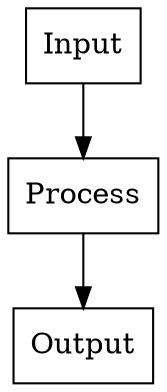
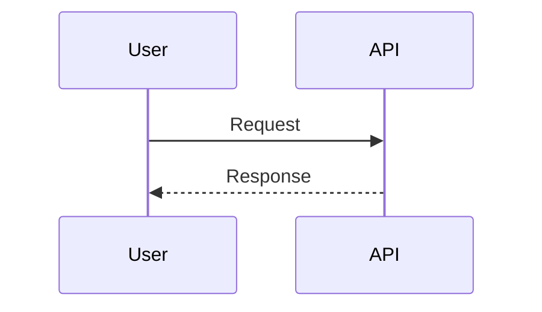

# Frame Evaluation Guide

Detailed criteria for evaluating extracted frames from screen recordings.

## Classification Types

| Content Type | Description | Examples |
|--------------|-------------|----------|
| `code` | Code snippets, terminal output | IDE, Jupyter notebook, terminal |
| `diagram` | Architecture, flowcharts, relationships | Whiteboard drawings, hand annotations |
| `visualization` | Charts, plots, data displays | Matplotlib plots, dashboards |
| `documentation` | External docs, websites | GitHub, official docs, wikis |
| `cluttered` | Multiple overlapping windows | Screen shares with noise |

## Critical Value Assessment

For EACH frame, answer these questions:

1. **Is this information already captured in the transcript/notes?**
   - If yes → likely DELETE (the text version is better)

2. **Is the visual presentation essential, or would text suffice?**
   - Code → Extract as code block, DELETE image
   - Config/parameters → Extract as table, DELETE image
   - Concepts explained in text → DELETE image

3. **Does this show a publicly available resource?**
   - Official documentation → DELETE (link to docs instead)
   - GitHub pages → DELETE (reference the repo)

4. **Is there distracting noise (other windows, chat, unrelated tabs)?**
   - If yes and valuable content exists → Consider CROP
   - If mostly noise → DELETE

5. **Would a clean diagram better convey this concept?**
   - Hand-drawn flowcharts → RE-CREATE in Graphviz
   - Annotated relationships → RE-CREATE in Graphviz/TikZ
   - Data flow explanations → RE-CREATE as diagram

## Decision Matrix

| Verdict | When to Use | Action |
|---------|-------------|--------|
| **DELETE** | Redundant, noisy, or better as text | Remove from notes, delete file |
| **EXTRACT** | Contains code/text not in transcript | Extract content to code block or table, then DELETE image |
| **CROP** | Partial value buried in clutter | Crop to essential portion, keep cropped version |
| **RE-CREATE** | Concept benefits from clean diagram | Create Graphviz/TikZ diagram, DELETE original |
| **KEEP** | Unique visual essential to understanding | Embed in notes as-is |

## Extracting Text/Code from Images

When a frame contains valuable code or configuration:

```markdown
**From screenshot at MM:SS:**
\`\`\`python
# Extracted code here
def example():
    pass
\`\`\`
```

Then DELETE the original image - the extracted code is more useful.

## Creating Clean Diagrams

When concepts would benefit from proper visualization, launch parallel sub-agents to create diagrams.

### Tool Selection

| Diagram Type | Tool | When to Use |
|--------------|------|-------------|
| Pipeline/workflow flows | Graphviz | Complex flows with clusters |
| Sequence diagrams | Mermaid | Interaction sequences, API flows |
| Data relationships | Graphviz | Entity-relationship style |
| Simple flowcharts | Mermaid | Quick, simple flows |
| Mathematical concepts | TikZ | Precise positioning, equations |
| Simple matrices | Markdown tables | No diagram needed |

Read the `graphviz-diagrams`, `mermaid-diagrams`, or `tikz-diagrams` skills for detailed guidelines.

### Validation Workflow

**IMPORTANT:** Keep original screenshot as reference until diagram is verified.

1. Create diagram source file (`.dot`, `.mmd`, or `.tex`)
2. Render preview format:
   - Graphviz: `dot -Tpng -Gdpi=150 diagram.dot -o diagram.png`
   - Mermaid: Use mermaid-cli or online renderer
3. **Compare rendered diagram against original screenshot**
4. Launch `visual-design-critic` agent to review
5. **ALWAYS ask user before accepting revisions** from the critic
6. Only after verification: render final SVG and delete original screenshot
7. Embed in notes: `![[diagram.svg]]`

### Common Meeting Diagram Templates

**Architecture Overview:**
```dot
digraph {
  rankdir=LR
  subgraph cluster_frontend { label="Frontend"; ... }
  subgraph cluster_backend { label="Backend"; ... }
}
```

**Data Flow:**


**Timeline/Sequence:**


## Extracting Structured Data

When frames contain tables, metrics, or benchmarks, extract to markdown for searchability.

### When to Extract

- Cost breakdowns and pricing tables
- Benchmark comparisons (performance metrics)
- Configuration parameters in tables
- Feature comparison matrices
- Any data that might be queried or compared later

### Extraction Approach

1. **Keep the image** as visual reference (crop first if needed)
2. **Extract to markdown table** immediately below the image
3. **Preserve exact values** - don't round or summarize

**Example:**
```markdown
![[12-45_benchmark-results.jpg]]

| Method | Time (ms) | Memory (MB) | Accuracy |
|--------|-----------|-------------|----------|
| Baseline | 145 | 512 | 94.2% |
| Optimized | 42 | 256 | 94.1% |
| New Approach | 28 | 128 | 95.3% |
```

### Benefits

- **Searchable:** Find "Optimized" or specific values later
- **Accessible:** Screen readers can parse tables
- **Comparable:** Easy to reference in discussions
- **Durable:** Data survives even if image is lost

## Deduplication

If multiple frames show nearly identical content (e.g., same code at different scroll positions):
- Keep only the most complete version
- Note the timestamp range in the notes if relevant
