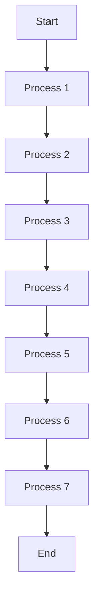
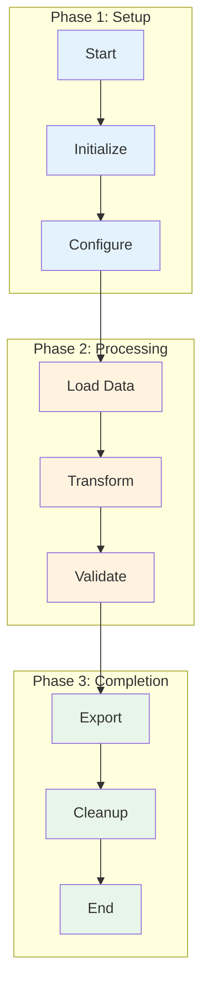

# Visual Design Feedback Loop

The `mermaid-expert` and `visual-design-critic` agents work together in an iterative feedback loop to produce high-quality diagrams and visualizations.

## Workflow

```
1. Create → 2. Critique → 3. Refine → 4. Validate
    ↑                                      ↓
    └──────────────────────────────────────┘
              (iterate until quality criteria met)
```

### Phase 1: Create
**Agent:** mermaid-expert

- Receives requirements from software-architect or obsidian-vault-manager
- Selects appropriate diagram type (flowchart, sequence, class, etc.)
- Generates initial Mermaid diagram with proper syntax
- Applies basic styling and layout

### Phase 2: Critique
**Agent:** visual-design-critic

- Receives the diagram for evaluation
- Analyzes using structured framework:
  - First impression (5-second test)
  - Information architecture
  - Readability assessment
  - Complexity analysis
  - Accessibility check
  - Design principles application

- Provides structured feedback:
  - Overall assessment
  - Strengths
  - Issues by severity (Critical/Moderate/Minor)
  - Specific recommendations
  - Alternative approaches

### Phase 3: Refine
**Agent:** mermaid-expert

- Receives critique from visual-design-critic
- Addresses critical issues first
- Makes moderate improvements
- Refines minor details
- Submits revised diagram for next iteration

### Phase 4: Validate
**Agent:** visual-design-critic

- Checks if critical issues are resolved
- Confirms quality criteria met:
  - Main message clear within 10 seconds
  - Visual hierarchy effective
  - No overlapping/ambiguous elements
  - Accessibility requirements met
  - Complexity matches audience

- **If valid:** Approve and store successful pattern
- **If not:** Return to Phase 3 with focused feedback

## Convergence Criteria

Iteration stops when:
- Diagram effectively communicates core message
- No critical issues remain
- Information hierarchy is clear
- Accessibility requirements met
- Viewer can understand within 30 seconds

## Learning Integration

After successful iterations:
- mermaid-expert stores successful diagram patterns in memory-knowledge-keeper
- visual-design-critic stores effective design patterns
- Both agents learn what works for specific content types
- Future diagrams benefit from accumulated knowledge

## Example Iteration

**Initial Diagram:**


**Critique:**
- **Critical:** Too linear, no grouping of related processes
- **Moderate:** No visual hierarchy, all nodes look the same
- **Recommendation:** Group related processes in subgraphs, use color coding for phases

**Refined Diagram:**


**Validation:** ✅ Approved
- Clear visual hierarchy with phases
- Related processes grouped
- Color coding aids understanding
- Message clear within 10 seconds

## Integration with Other Agents

**software-architect:**
- Requests diagrams for architecture documentation
- Receives critique-validated diagrams
- Benefits from clear visual communication

**obsidian-vault-manager:**
- Embeds validated diagrams in notes
- Ensures knowledge base has high-quality visuals
- Improves learning and retention

**memory-knowledge-keeper:**
- Stores successful diagram patterns
- Tracks which design approaches work best
- Enables cross-project learning

## Benefits

1. **Quality assurance:** Diagrams are systematically evaluated before use
2. **Continuous improvement:** Both agents learn from iterations
3. **Accessibility:** Ensures diagrams work for all users
4. **Clarity:** Forces focus on communication effectiveness
5. **Consistency:** Builds library of proven patterns

---

This feedback loop ensures that visual documentation meets high standards for clarity, effectiveness, and accessibility while building institutional knowledge about what works.
